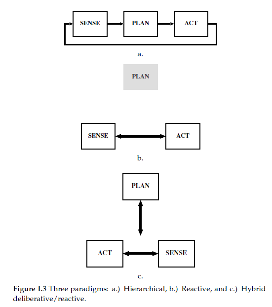
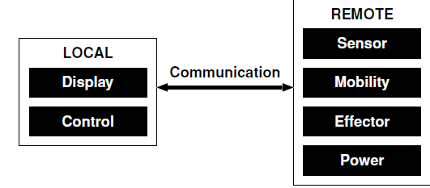

# Exercises - Chapter 1

## From Teleoperation To Autonomy
---
1. List the four attributes for evaluating an architecture. Based on what you know from your own experience, evaluate MS Windows 95/98/2000 as an architecture for tele operating a robot.
    - Since a major objective in robotics is to learn how to build them, an important skill to develop is evaluating whether or not a previously developed architecture (or large chunks of it) will suit the current application. This skill will save both time spent on re-inventing the wheel and avoid subtle problems that other people have encountered and solved. Evaluation requires a set of criteria.

		    MODULARITY - Support for modularity: does it show good software engineering principles?
			
		    NICHE TARGETABILITY - how well does it work for the intended application?
			
		    PORTABILITY - Ease of portability to other domains: how well would it work for other applications or other robots?
			
		    ROBUSTNESS - Robustness: where is the system vulnerable, and how does it try to reduce that vulnerability?

2. Name the three primitives for expressing the components of a robotics paradigm.
    * By the relationship between the three commonly accepted primitives of robotics: SENSE, PLAN, ACT.

3. Name the three robotic paradigms, and draw the relationship between the primitives.

4. What is an intelligent robot?
    * An intelligent robot is a mechanical creature which can function autonomously.

5. What is a Luddite?

    * People who object to robots, or technology in general, are ofren called Luddites, after Ned Ludd, who is often credited with leading a short-lived revolution of workers against mils in Britain.

6. 	Describe at least two differences between AI and Engineering approaches to robotics.

	* Robots for manufacturing took a fork that has focused on engineering robot arms for manufacturing applications. The key to success in industry was precision and repeatability on the assembly line for mass pro duction, in effect, industrial engineers wanted to automate the workplace. Once a robot arm was programmed, it should be able to operate for weeks and months with only minor maintenance. 
	Because assembly lines were engineered to mass produce a certain product, the robot didn’t have to be able to notice any problems. 
	* The fork toward AI robots has not reached a termination point of truly au tonomous, intelligent robots. A single, precise definition of AI is not necessary to study AI robotics. AI robotics is the application of AI techniques to robots. More specifically, AI robotics is the consideration of issues traditional covered by AI for applica tion to robotics: learning, planning, reasoning, problem solving, knowledge representation, and computer vision.
	* It is interesting to note that the two forks, manufacturing and AI, currently appear to be merging.

7. List three problems with teleoperation.

	* Teleoperation is when a human operator controls a robot from a distance (tele means “remote”).
    * Teleoperation is not an ideal solution for all situations. Many tasks are repetitive and boring. For example, consider using a joystick to drive a radio-controlled car; after a few hours, it tends to get harder and harder to pay attention.
	* Most people quickly experience cognitive fatigue; their attentionwanders and theymay even experience headaches and other physical symptoms of stress. Even if the visual display is excellent, the teleoperatormay get simulator sickness due to the discordance between the visual system saying the operator is moving and the inner ear saying the operator is stationary.
	* Another disadvantage of teleoperation is that it can be inefficient to use for applications that have a large time delay A large time delay can result in the teleoperator giving a remote a command, unaware that it will place the remote in jeopardy. Or, an unanticipated event such as a rock fallmight occur and destroy the robot before the teleoperator can see the event and command the robot to flee. A rule of thumb, or heuristic, is that the time it takes to do a task with traditional teleoperation grows linearly with the transmission delay. A teleoperation task which  took 1 minute for a teleoperator to guide a remote to do on the Earth might take 2.5 minutes to do on theMoon, and 140 minutes on Mars. Fortunately, researchers have made some progress with PREDICTIVE DISPLAYS predictive displays, which immediately display what the simulation result of the command would be.

8. Describe the components and the responsibilities of the local and the remote members of a telesystem.
    * The human operator, or teleoperator, is often referred to as the local (due to being at the local workstation) and the robot as the remote (since it is operating at a remote location fromthe teleoperator). The local must have some type of display and control mechanisms, while the remote must have sensors, effectors, power, and in the case of mobile robots, mobility.

9. Describe the difference between telepresence and semi-autonomous control.
    * Another line of research in teleoperation is semi-autonomous control, often called supervisory control, where the remote is given an instruction or portion of a task that it can safely do on its own. If the teleoperator delegates the task to the robot, the human must still monitor to make sure that nothing goes wrong. This is particularly useful for teleoperating robot arms in space. The operator can relax (relatively) while the robot arm moves into the specified position near a panel, staying on alert in case something goes wrong. Then the operator can take over and perform the actions which require hand-eye coordination.
    * Telepresence aims for what is popularly called virtual reality, where the operator has complete sensor feedback and feels as if she were the robot. If the operator turns to look in a certain direction, the view from the robot is there. If the operator pushes on a joystick for the robot to move forward and the wheels are slipping, the operator would hear and feel the motors straining while seeing that there was no visual change

10. List the six characteristics of applications that are well suited for teleoperation. Give at least two examples of potentially good applications for teleoperation not covered in the chapter.

    1. The tasks are unstructured and not repetitive.
	2. The task workspace cannot be engineered to permit the use of industrial
		manipulators.
	3. Key portions of the task intermittently require dextrousmanipulation, especially hand-eye coordination.
    4. Key portions of the task require object recognition, situational awareness, or other advanced perception.
	5. The needs of the display technology do not exceed the limitations of the communication link (bandwidth, time delays).
    6. The availability of trained personnel is not an issue.

11. [WorldWideWeb] Search the world wide web for sites that permit clients to use a robot remotely (one example is Xavier at Carnegie Mellon University). Decide whether each site is using human supervisory or shared control, and justify your answer.

	* Another line of research in teleoperation is semi-autonomous control, often called supervisory control, where the remote is given an instruction or portion of a task that it can safely do on its own. There are two flavors of semi-autonomous control: continuous assistance, or shared control, and control trading.
    * In continuous assistance systems, the teleoperator and remote share control. The teleoperator can either delegate a task for the robot to do or can do it via direct control. If the teleoperator delegates the task to the robot, the human must still monitor to make sure that nothing goes wrong. This is particularly useful for teleoperating robot arms in space. The operator can relax (relatively) while the robot arm moves into the specified position near a panel, staying on alert in case something goes wrong. Then the operator can take over and perform the actions which require hand-eye coordination. Shared control helps the operator avoid cognitive fatigue by delegating boring, repetitive control actions to the robot.
    * An alternative approach is control trading,where the human initiates an action for the robot to complete autonomously. The human only interacts with the robot to give it a new command or to interrupt it and change its orders. The overall scheme is very much like a parent giving a 10-year old child a task to do. The parent knows what the child is able to do autonomously (e.g., clean their room). They have a common definition (clean room means go to the bedroom, make the bed, and empty the wastebaskets). The parent doesn’t care about the details of how the child cleans the room (e.g., whether the wastebasket is emptied before the bed is made or vice versa). Control trading assumes that the robot is capable of autonomously accomplishing certain tasks without sharing control.

12. [WorldWideWeb] Search the world wide web for applications and manufacturers of intelligent robots.

    * COMPANIES USING AI ROBOT TECHNOLOGY 
		* Boston Dynamics 
		* Canvas Technology 
		* DroneSense 
		* iRobot
        * Miso Robotics 
		* Neurala 
		* Rethink Robotics
	* Starship Delivery Robots
		* Starship robots can carry items within a 4-mile (6km) radius, navigate streets autonomously, and provide package delivery for consumers and businesses.
    * Pepper Humanoid Robot
		* Pepper is a humanoid robot designed to interact with people assist them, share information with them, and help customers at retail stores.
	* Penny Restaurant Robot
		* Penny is a bowling pin-shaped food-service robot enabled by artificial intelligence. It can autonomously shuttle food and drinks from a restaurant kitchen out to tables and bring dishes back for a cleaning.
	* Nimbo Security Robot
		* Nimbo is a robot security guard based on cutting-edge artificial intelligence technology and has a range of security applications and asset protection.
	* Shadow Dexterous Hand
		* The Shadow Dexterous Hand is a humanoid robot hand that is similar to the average human male hand in size and shape. It has movements equivalent to the typical human hand.

13. [WorldWideWeb] Dr. Harrison “Jack” Schmitt is a vocal proponent for space mining of Near Earth Objects (NEOs) such as mineral-rich asteroids. Because of the economics of manned mission, the small size of NEOs, human safety concerns, and the challenges of working in micro-gravity, space mining is expected to require intelligent robots. Search the web for more information on space mining, and give examples of why robots are needed.

	* Chinese private space resources company Origin Space is reportedly gearing up to send the world’s first mining robot into space. The robot will not do any actual mining but will be used to test technologies. Under the mission, Origin Space will conduct a preliminary assessment of the asteroid mining robot’s capabilities to identify and extract valuable resources. The mission is aimed at the eventual mining of asteroids. 
    * NASA Training 'Swarmie' Robots for Space Mining A swarm of small, clever robots could be key to self-sufficient solar system exploration. The process of robotic mining itself is well established on Earth, and NASA holds an annual Robotic Mining Competition to help drive university-level research and innovation with robots competing to mine the most simulated Martian regolith. Even private companies are working on off-world mining robots. The mining hardware is a work in progress, but prospecting for the good stuff (water, ice, minerals, metals, helium-3, etc.) is more difficult. We can get a sense of generally where resources are concentrated using multispectral imaging from orbit (or from aerial platforms, where atmosphere is available), but finding the best specific little spot to start digging requires exploration and sensing at a much finer resolution.

14. [Programming] (This requires a robot with an on-board video camera and a teleoperation interface.) Teleoperate the robot through a slalom course of obstacles while keeping the robotin view as if controlling a RC car.  Now looking only at the output of the video camera, repeat the obstacle course. Repeat the comparison several times, and keep trackof the time to complete the course and number of collisions with obstacles.  Which viewpoint led to faster completion of the course? Fewer collisions? Why?
	* In general, teleoperating the robot using a video feed from the robot's own camera would likely result in slower completion of the course and more collisions, compared to controlling the robot directly.

	* When teleoperating the robot using the video feed from the robot's camera, the operator must rely on the camera's limited field of view and resolution to navigate the robot through the course. This can make it difficult to see obstacles and other important details, which can lead to slower completion of the course and more collisions.

	* On the other hand, when controlling the robot directly, the operator has a much better view of the course and can see obstacles and other details more easily. This can allow for faster completion of the course and fewer collisions. Additionally, the operator can respond more quickly to changes in the environment and avoid obstacles more effectively.

	* Overall, the choice of viewpoint will depend on the specific robot and obstacle course in question, as well as the operator's skill and experience. In general, however, controlling the robot directly is likely to result in faster completion of the course and fewer collisions.	

15. [Advance Reading] Read “Silicon Babies,” Scientific American, December 1991, pp 125-134, on the challenges of AI robotics. List the 7 topics of AI and give examples of robots or researchers addressing each topic.

	* **I don't have access to this publication**

16. [Science Fiction] Read “Stranger in Paradise,” Isaac Asimov, The Complete Robot, Doubleday, 1982, and enumerate the problems with telepresence illustrated by this story.

    * The speed of light communications lag between Earth and Mercury can last up to twenty-two minutes, making computer control difficult.

	* The story is about a telepresence robot that is used by a scientist named Dr. Calvin to explore a distant planet.

	* The story illustrates several problems with telepresence, including the challenges of remote communication and control, the limitations of technology, and the psychological effects of isolation.

	* One of the problems with telepresence that is illustrated in the story is the difficulty of communicating and controlling a robot from a distance. In the story, Dr. Calvin uses a telepresence robot to explore the planet, but she has trouble communicating with the robot and controlling its movements. This makes it difficult for her to gather useful information and complete her mission.

	* Another problem with telepresence that is illustrated in the story is the limitations of technology. Despite being a highly advanced robot, the telepresence robot in the story is not able to provide Dr. Calvin with all the information she needs. For example, the robot's sensors are not able to detect all the features of the planet's surface, and its communication system is not reliable. This makes it difficult for Dr. Calvin to make accurate observations and conclusions about the planet.

	* A third problem with telepresence that is illustrated in the story is the psychological effects of isolation. As Dr. Calvin uses the telepresence robot to explore the planet, she begins to feel isolated and disconnected from the world around her. She becomes increasingly anxious and paranoid, and eventually suffers a mental breakdown. This shows the potential negative psychological effects of using telepresence technology.

	* Overall, "Stranger in Paradise" is a thought-provoking story that raises important questions about the challenges and limitations of telepresence technology. It illustrates the potential problems that can arise when using telepresence robots, and highlights the need for further research and development in this area.

17. [Science Fiction] Watch the movie Star Gate. The military uses a teleoperated vehicle (in reality, NASAJet Propulsion Laboratory’s Hazbot) to first go through the star gate and test the environmental conditions on the other side. Discuss other ways in which the team could have continued to use the robot to their advantage.

	* In the movie Star Gate, the military uses a teleoperated vehicle to explore an alien planet through a star gate. The teleoperated vehicle, which is based on NASA's Hazbot, allows the team to gather information about the planet's environment without risking the lives of human astronauts.

	* There are several ways in which the team could have continued to use the robot to their advantage. For example, they could have used the robot to explore and map the planet, gathering detailed information about its geography, climate, and resources. This would have allowed them to plan future missions and make more informed decisions about what to do next.

	* Another way in which the team could have used the robot to their advantage is by using it to collect samples of the planet's soil, water, and air. This would have allowed them to analyze the planet's atmosphere and determine whether it is suitable for human habitation.

	* In addition, the team could have used the robot to perform various tasks on the planet, such as deploying sensors, setting up communication systems, or collecting data on the planet's natural resources. This would have allowed them to gather more information about the planet and better understand its potential for future exploration and development.

	* Overall, there are many ways in which the team in Star Gate could have continued to use the robot to their advantage. By leveraging the robot's capabilities and versatility, they could have gathered valuable information and made more informed decisions about how to proceed with their mission.

18. [Science Fiction] Watch the 1971 movie,The Andromeda Strain, by Michael Crichton.  The movie has several nerve wracking scenes as  the scientists try to telemanipulate an unknown, deadly organism as fast as possible without dropping it.  What do you think can be done with today’s robots?
	* Today's robots are much more advanced than the one depicted in the movie, and are capable of performing a wide range of tasks with greater precision and speed. For example, modern robots can be equipped with advanced sensors and manipulators, allowing them to handle delicate objects with a high degree of precision and control. They can also be programmed to follow complex instructions and operate autonomously, without the need for direct human control.

	* In the context of the movie, this means that modern robots could be used to handle dangerous organisms with greater speed and accuracy, reducing the risk of contamination or accidents. For example, robots could be used to collect and transport samples of the organism, or to perform experiments on it in a controlled environment. This would allow scientists to study the organism more closely, without putting themselves in danger.

	* Overall, modern robots have the potential to greatly improve the speed and safety of handling dangerous organisms, such as the one depicted in The Andromeda Strain. By leveraging their advanced capabilities and versatile design, robots can play a crucial role in studying and understanding these organisms, and help us to better protect ourselves from their potentially harmful effects