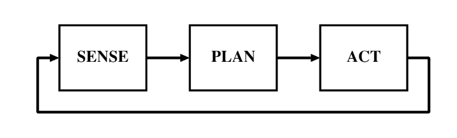
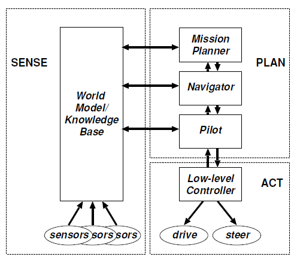

# Exercises - Chapter 2

## The Hierarchical Paradigm
---

1. Describe the Hierarchical Paradigm in terms of a) the SENSE, PLAN, ACT primitives and b) sensing organization.

    * The Hierarchical Paradigm is sequential and orderly, as shown in Fig below:

    

    

    * First the robot senses the world and constructs a global world map. Then “eyes” closed, the robot plans all the directives needed to reach the goal. Finally, the robot acts to carry out the first directive. After the robot has carried out the SENSE-PLAN-ACT sequence, it begins the cycle again: eyes open, the robot senses the consequence of its action, replans the directives (even though the directives may not have changed), and acts

2. Define the following terms in one or two sentences. Give an example of how each arises in a robotic system.

    * **Precondition:**
    The robot needs to be able to distinguish between some operator. This is done by listing PRECONDITIONS the preconditions that have to be true in order to execute that particu lar operator. The preconditions are a column in the difference table, where a single operator can have multiple preconditions.
    * **Closed world assumption:**
    the closed world  assumption says that the world model contains everything the robot needs to know: there can be no surprises. If the closed world assumption is violated, the robot may not be able to function correctly. But, on the other hand, it is very easy to forget to put all the necessary details into the world model. As a result, the success of the robot depends on how well the human programmer can think of everything
	* **Open world:**
    When roboticists say that “a robot must function in the open world,” they are saying the closed world assumption cannot be applied to that particular domain.
    * **Frame problem**
    The problem of representing a real-world situation in a way that was computationally tractable became known as the frame problem

1. Consider the frame problem. Suppose the World Model for a Strips-based robot con-sisted of 100 facts. Each fact requires 1KB of memory storage. Every time a new objectis added to the world model, it increases the model by 100 (a linear increase).  Oneobject, 100 facts, 100KB of storage; two objects, 200 facts, 200KB. How many objectswould fill 64KB of memory?
    * 

1. Redo the above exercise where the number of facts in the world model doubles everytime a new object  is added (exponential).   One object,  100  facts,  1KB,  two objects,200 facts, 200KB, three objects, 400 facts, 400KB. Which is a more reasonable rate toassume the world model would increase at, linear or exponential?
    * 

1. Describe the mission planner, navigator, pilot organization of the Nested HierarchicalController. Write down how it would handle the problem in Sec. 2.2.2.

    

    * The major contribution of NHC was its clever decomposition of planning into 3 different functions or subsystems aimed at supporting navigation: the Mission Planner, the Navigator, and the Pilot.
	* Planning for navigation has a local procedure consisting of three steps executed by the Mission Planner, Navigator, and Pilot.
	* The Mission Planner is responsible for operationalizing, or translating, this mission into terms that other functions can understand
    * The Navigator takes this information and generates a path from the current location to the goal.
	* The path is passed to the Pilot. The Pilot takes the first straight line or path segment and determines what actions the robot has to do to follow the path segment. For instance, the robot may need to turn around to face the way point before it can start driving forward.

1. List 2 advantages and disadvantages of the Hierarchical Paradigm.

    * The primary advantage of the Hierarchical Paradigm was that it provides an ordering of the relationship between sensing, planning, and acting. The primary disadvantage was planning. Every update cycle, the robot had to update a global world model and then do some type of planning. The sensing and planning algorithms of the day were extremely slow (and many still are), so this introduced a significant bottleneck. Notice also that sensing and acting are always disconnected. This effectively eliminated any stimulusresponse types of actions (“a rock is crashing down on me, I should move anywhere”) that are seen in nature.
    * Another issue that was never really handled by architectures in the Hierarchical Paradigm was uncertainty. Uncertainty comes in many forms, such as semantic (how close does NEXTTO mean anyway?), sensor noise, and actuator errors. 

1. Solve the following navigation problem using Strips. Return to the world in Sec 2.2.2.The robot will move to the boxB1and pick it up.
    - a.Add a new operatorpickupto the difference table.
    - b.Use the world model,  difference table,  difference evaluator to construct a plan.Failed preconditions and new subgoals should be shown after each step.
    - c.Show the changes in the world model aftereachoperator is applied.

1. Name and evaluate one representative Hierarchical architecture in terms of: supportfor modularity, niche targetability, ease of portability to other domains, robustness.

    * **Nested Hierarchical Controller:** Nested Hierarchical Controller architecture has components that are easily identified as either SENSE, PLAN, or ACT. The robot begins by gathering observations from its sensors and combining those observations to form the World Model data structure through the SENSE activity. The World Model may also contain a priori knowledge about the world, for example, maps of a building, rules saying to stay away from the foyer during the start and finish of business hours, etc. After the World Model has been created or updated, then the robot can PLAN what actions it should take. Planning for navigation has a local procedure consisting of three steps executed by the Mission Planner, Navigator, and Pilot. Each of these modules has access to the World Model in order to compute their portion of planning. The last step in planning is for the Pilot module to generate specific actions for the robot to do (e.g., Turn left, turn right, move straight at a velocity of 0.6 meters per second). These actions are translated into actuator control signals (e.g., Velocity profile for a smooth turn) by the Low-Level Controller. Together, the Low-Level Controller and actuators form the ACT portion of the architecture.
	* **NIST RCS:** SENSE activities are grouped into a set of modules under the heading of sensory perception. The output of the sensors is passed off to the world modeling module which constructs a global map using information in its associated knowledge database about the sensors and any domain knowledge.
    
1. [World Wide Web] Search the web for interactive versions of Strips and experiment with them.