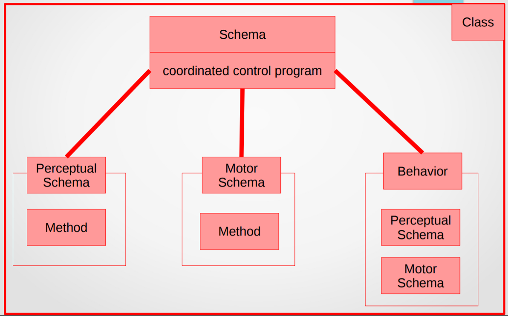

# Exercises - Chapter 3

## Biological Foundations of the Reactive Paradigm

---

1. Describe the three levels in a Computational Theory.
    * Level 1: Existence proof of what can/should be done.
        * At Level 1, agents can share a commonality of purpose or functionality. The computational level is the highest level of analysis and deals with the problem that the visual system is trying to solve. It involves understanding the goals and objectives of the visual system and the function it serves in the overall organism.
    * Level 2: Decomposition of “what” into inputs, outputs, and transformations.
        * This level can be thought of as creating a flow chart of “black boxes.” Each box represents a transformation of an input intoan output. The algorithmic level is the middle level of analysis and involves understanding the specific steps and procedures that the visual system uses to solve the problem at the computational level. This includes the processes of image formation, image processing, and object recognition.
    * Level 3: How to implement the process.
        * This level of the computational theory focuses on describing how each transformation, or black box, is implemented. The implementational level is the lowest level of analysis and deals with the physical implementation of the visual system. It involves understanding the hardware and software systems that enable the visual system to perform its functions, including the neural and physical mechanisms that underlie image formation and processing.

    Together, these three levels of analysis provide a comprehensive understanding of the process of vision and how it is implemented in the brain and nervous system.

    In the context of robotics, the three levels of analysis proposed by David Marr can be used to understand how a robotic system is designed to solve a particular problem or perform a specific task.

    At the computational level, we would consider the overall goals and objectives of the robotic system and the function it serves within the larger context of the application it is being used for. For example, a robotic system might be designed to perform a specific manufacturing task, such as assembling a product on a production line.

    At the algorithmic level, we would consider the specific steps and procedures that the robotic system uses to solve the problem at the computational level. This might involve understanding how the robotic system is programmed to move and manipulate objects, how it processes sensory information from its environment, and how it makes decisions about what actions to take next.

    At the implementational level, we would consider the physical hardware and software systems that enable the robotic system to perform its functions. This might involve understanding the mechanical components of the robotic system, such as its motors and actuators, as well as the sensors and control systems that allow it to interact with its environment and carry out its tasks.

    By understanding the three levels of analysis in the context of robotics, we can gain a comprehensive understanding of how a robotic system is designed and how it functions in practice.

1. Explain in one or two sentences each of the following terms: reflexes, taxes, fixedaction patterns, schema, affordance.
    * Reflexes $-$ where the response lasts only as long as the stimulus, and the response is proportional to the intensity of the stimulus.
    * Taxes $-$ where the response is to move to a particular orientation
    * Fixedaction Patterns $-$ where the response continues for a longer duration than the stimulus.
    * Schema $-$  consists both of the knowledge of how to act and/or perceive (knowledge, data structures, models) as well as the computational process by which it is uses to accomplish the activity (the algorithm).
    * Affordance $-$ Affordances are perceivable potentialities of the environment for an action

1. Represent a schema, behavior, perceptual schema, and motor schema with an Object- Oriented Design class diagram.

    * <p align="center"></p>

1. Many mammals exhibit a camouflage meta-behavior. The animal freezes when it sees motion (an affordance for a predator) in an attempt to become invisible. It persists until the predator is very close, then the animal flees. (This explains why squirrels freeze in front of cars, then suddenly dash away, apparently flinging themselves under the wheels of a car.) Write pseudo-code of the behaviors involved in the camouflage behavior in terms of innate releasing mechanisms, identifying the releasers for each behavior.

    ```C++
    CamouflageBehavior {
    // Innate releasing mechanisms
    IRM freezeWhenMotionDetected {
        trigger: motion detected
        behavior: freeze
    }
    IRM fleeWhenPredatorClose {
        trigger: predator close
        behavior: flee
    }

    // Behaviors
    behavior freeze {
        action: stop moving
    }
    behavior flee {
        action: run away
    }
    }

    ```
    
    In this representation, the camouflage behavior is composed of two innate releasing mechanisms (IRMs): freezeWhenMotionDetected and fleeWhenPredatorClose. The freezeWhenMotionDetected IRM is triggered when motion is detected, and it releases the freeze behavior. The fleeWhenPredatorClose IRM is triggered when the predator is close, and it releases the flee behavior. 
    
    The freeze behavior involves stopping movement, and the flee behavior involves running away. It's worth noting that this is just one possible way to represent the camouflage behavior in pseudo-code, and there are many other ways that might also be suitable. The specific approach will depend on the context and the intended purpose of the representation.

1. Consider a mosquito hunting for a warm-blooded mammal and a good place to bite them. Identify the affordance for a warm-blooded mammal and the associated behavior. Represent this with schema theory (perceptual and motor schemas).
    According to schema theory, an affordance is a perceivable property of the environment that suggests a possible action or interaction. In the case of a mosquito hunting for a warm-blooded mammal, the affordance might be the presence of a warm body with a suitable surface for biting (such as exposed skin). The associated behavior might be the act of biting the warm-blooded mammal to obtain a blood meal.

    Here is a possible representation of this scenario using schema theory:

    Perceptual schema:
    ```
    DetectWarmBody {
    input: sensory data (e.g. thermal image, infrared sensors)
    output: presence/absence of warm body
    }
    ```
    Motor schema:
    ```
    BiteWarmBody {
    input: presence of warm body
    output: biting behavior (e.g. landing on skin, inserting mouthparts)
    }
    ```
    In this representation, the mosquito uses its perceptual schema DetectWarmBody to detect the presence of a warm body in its environment. If a warm body is detected, the mosquito uses its motor schema BiteWarmBody to execute the biting behavior. The input to the BiteWarmBody schema is the presence of a warm body, which is provided by the output of the DetectWarmBody schema. The output of the BiteWarmBody schema is the actual biting behavior, which is executed by the mosquito's body.

    Again, this is just one possible way to represent the mosquito's hunting behavior using schema theory, and there may be other ways to do it as well. The specific approach will depend on the context and the intended purpose of the representation.

1. One method for representing the IRM logic is to use finite state automata (FSA), which are commonly used in computer science. If you have seen FSAs, consider a FSA where the behaviors are states and releasers serve as the transitions between state. Express the sequence of behaviors in a female digger wasp as a FSA.
    Finite state automata (FSAs) are a type of mathematical model that can be used to represent the logic of a system with a finite number of states and transitions between those states. FSAs are commonly used in computer science to represent the logic of systems that exhibit discrete, deterministic behavior.

    Here is a possible FSA representation of the sequence of behaviors in a female digger wasp, where the behaviors are represented as states and the releasers serve as transitions between states:

    ```C++
    FSA {
    // States
    state SearchForNestSite {
        // Releasers
        transition: nest site found
        next state: DigNest
    }
    state DigNest {
        // Releasers
        transition: nest dug
        next state: FindPrey
    }
    state FindPrey {
        // Releasers
        transition: prey found
        next state: CapturePrey
    }
    state CapturePrey {
        // Releasers
        transition: prey captured
        next state: TransportPrey
    }
    state TransportPrey {
        // Releasers
        transition: prey delivered
        next state: Repeat
    }
    state Repeat {
        // Releasers
        transition: prey consumed
        next state: SearchForNestSite
    }
    }
    ```

    In this representation, the female digger wasp has five states: SearchForNestSite, DigNest, FindPrey, CapturePrey, and TransportPrey. The wasp begins in the SearchForNestSite state and transitions to the DigNest state when a suitable nest site is found. It then transitions to the FindPrey state when the nest is dug, and so on. The final state, Repeat, represents the point at which the wasp returns to the beginning of the sequence to search for a new nest site.

    It's worth noting that this is just one possible way to represent the sequence of behaviors in a female digger wasp using an FSA, and there may be other ways to do it as well. The specific approach will depend on the context and the intended purpose of the representation.

1. Lego Mindstorms and RugWarrior kits contain sensors and actuators which are coupled together in reflexive behaviors. Build robots which: Reflexive avoid: turn left when they touch something (use touch sensor and two motors) Phototaxis: follow a black line (use the IR sensor to detect the difference between light and dark) Fixed-action pattern avoid: back up and turn right when robot encounters a “negative obstacle” (a cliff)
    * Reflexive avoid: To build a robot that turns left when it touches something, you can use a touch sensor and two motors. The touch sensor can be mounted on the front of the robot, and the two motors can be used to control the movement of the robot's wheels. When the touch sensor is activated (e.g. when it comes into contact with an obstacle), the robot can turn left by reversing one of the motors and driving the other motor forward.

    * Phototaxis: To build a robot that follows a black line, you can use an infrared (IR) sensor to detect the difference between light and dark. The IR sensor can be mounted on the front of the robot and pointed downward, so that it can detect the contrast between the black line and the surrounding surface. The robot can then use the output from the IR sensor to adjust its speed and direction, so that it follows the black line.

    * Fixed-action pattern avoid: To build a robot that backs up and turns right when it encounters a "negative obstacle" (a cliff), you can use a rangefinder or ultrasonic sensor to detect the presence of the obstacle. The rangefinder or ultrasonic sensor can be mounted on the front of the robot and pointed downward, so that it can detect the distance to the surface below. When the sensor detects an obstacle at a distance that is too close for the robot to safely navigate, the robot can execute a fixed-action pattern of backing up and turning right.

1. What is the difference between direct perception and recognition?
    * **Direct perception** is the “Gibsonian,” or ecological, track of the brain, and consists of structures low in the brain which evolved earlier on and accounts for affordances.
    * **Recognition** is more recent perceptual track in the brain, which ties in with the problemsolving and other cognitive activities. This part accounts for the use of internal models to distinguish “your coffee cup” from “my coffee cup.” This is where top-down, model-based perception occurs.

1. Consider a cockroach, which typically hides when the lights are turned on. Do you think the cockroach is using direct perception or recognition of a hiding place? Explain why. What are the percepts for the cockroach?
    * It is likely that the cockroach uses direct perception rather than recognition of a hiding place when it hides when the lights are turned on. Direct perception refers to the process of directly sensing and interpreting environmental stimuli in the present moment, without the need for prior learning or memory. This is in contrast to recognition, which involves the use of stored knowledge or memories to identify and classify objects or events. In the case of the cockroach hiding when the lights are turned on, it is likely that the cockroach is using direct perception to detect the sudden change in light level and respond accordingly. The percepts for the cockroach in this situation might include the intensity and spectrum of the light, as well as other sensory inputs such as the presence of shadows or changes in the temperature or humidity of the environment. It's worth noting that cockroaches and other insects have a wide range of sensory modalities, including vision, smell, touch, and hearing, which they use to gather information about their environment. The specific percepts that the cockroach uses to detect the lights being turned on will depend on the modalities that are available to it and the specifics of the environment in which it is located.

1. Describe how cancellation could happen as a result of concurrency and incomplete FSA.
    * Cancellation can occur as a result of concurrency and incomplete finite state automata (FSAs) when two or more behaviors or actions are being executed simultaneously, and one of the behaviors or actions causes the other(s) to be cancelled or terminated. This can happen when an FSA is incomplete in the sense that it does not account for all possible interactions or conflicts between behaviors. For example, consider a robot that is programmed to execute two behaviors concurrently: one behavior that moves the robot forward and another behavior that turns the robot to the left. These behaviors might be represented in an FSA as two separate states, with transitions between them based on relevant triggers or releasers. However, if the robot encounters an obstacle while executing the turning behavior, it might need to cancel the forward movement behavior in order to avoid the obstacle. If the FSA does not include a state or transition that accounts for this situation, the cancellation of the forward movement behavior might not be properly handled, leading to unexpected or undesirable behavior. Cancellation can also occur as a result of concurrency when two or more behaviors or actions have conflicting goals or requirements. For example, if a robot is programmed to both follow a black line and avoid obstacles, and it encounters an obstacle that is blocking the black line, it might need to cancel one of the behaviors in order to achieve the other. If the FSA does not include a state or transition that accounts for this situation, the cancellation of one of the behaviors might not be properly handled, leading to unexpected or undesirable behavior. Overall, cancellation can be a complex issue in the context of concurrency and incomplete FSAs, and it is important to carefully consider and design for all possible interactions and conflicts between behaviors in order to avoid unintended consequences.

1. [Advanced Reading] Read the first four chapters in Braitenberg’s Vehicles. Write a 2-5 page paper: List and describe the principles of behaviors for robotics in Ch. 3. Discuss how Vehicles is consistent with the biological foundations of reactivity. Be specific, citing which vehicle illustrates what principle or attribute discussed in the book. Discuss any flaws in the reasoning or inconsistency between Vehicles with the biological foundations of reactivity or computer science.
    * In Chapter 3 of "Vehicles," Valentino Braitenberg outlines several principles of behaviors for robotics, including the principle of the "logical sum," the principle of the "logical product," and the principle of the "inverse of the logical product." The principle of the "logical sum" states that the overall behavior of a robotic system can be determined by the sum of the individual behaviors of its components. For example, in Vehicle 1, Braitenberg shows how the combination of simple behaviors such as light-seeking and collision avoidance can produce more complex behaviors such as obstacle avoidance and goal-directed movement. The principle of the "logical product" states that the overall behavior of a robotic system can be determined by the interaction of the individual behaviors of its components. For example, in Vehicle 2, Braitenberg shows how the interaction between two light-seeking behaviors can produce behaviors such as circular movement and figure-eight patterns. The principle of the "inverse of the logical product" states that the overall behavior of a robotic system can be determined by the inverse of the interaction of the individual behaviors of its components. For example, in Vehicle 3, Braitenberg shows how the inverse of the interaction between two light-seeking behaviors can produce behaviors such as approach and avoidance. Overall, Braitenberg's "Vehicles" is largely consistent with the biological foundations of reactivity, in that it demonstrates how simple behaviors can be combined and interacted in various ways to produce more complex behaviors. However, there are some flaws in the reasoning or inconsistencies between "Vehicles" and the biological foundations of reactivity or computer science. For example, some of the behaviors described in the book may not be representative of real-world biological systems, and the underlying mechanisms of the behaviors may be oversimplified or incompletely understood. Additionally, the book does not address some important aspects of reactivity, such as learning and adaptation, which are central to many biological systems. Overall, "Vehicles" provides a useful and thought-provoking exploration of the principles of behaviors for robotics, but it should be considered in the context of other research and understanding of biological foundations of reactivity and computer science.

1. [Advanced Reading] Read “Sensorimotor transformations in the worlds of frogs and robots,” by Arbib and Liaw. List and describe how the principles of schema theory and potential fields for robotics given in Ch. 3. Summarize the main contributions of the paper.
    * In Chapter 3 of "Sensorimotor transformations in the worlds of frogs and robots," Arbib and Liaw outline several principles of schema theory and potential fields for robotics, including the following: 
        1. Schema theory: Schema theory is a framework for understanding how animals and robots process sensory information and generate motor behaviors. According to schema theory, animals and robots use a combination of fixed action patterns (FAPs), innate releasing mechanisms (IRMs), and perceptual schemas to interact with their environment and achieve their goals. 
        2. FAPs: FAPs are pre-programmed behaviors that are triggered by specific stimuli or releasers. FAPs are typically simple and stereotyped, and they can be triggered by a wide range of stimuli. 
        3. IRMs: IRMs are neural mechanisms that mediate the interaction between stimuli and behaviors. IRMs are typically simple and stereotyped, and they are responsible for releasing FAPs in response to specific stimuli. 
        4. Perceptual schemas: Perceptual schemas are neural structures that process sensory information and generate outputs that can be used by other neural structures or behaviors. Perceptual schemas are typically more complex and flexible than FAPs and IRMs, and they can be modified by learning or experience.
    * In their paper, Arbib and Liaw describe how these principles of schema theory and potential fields can be applied to the design and control of robotic systems. They also discuss the main contributions of the paper, which include the development of a framework for understanding sensorimotor transformations in robots, the identification of key principles and
