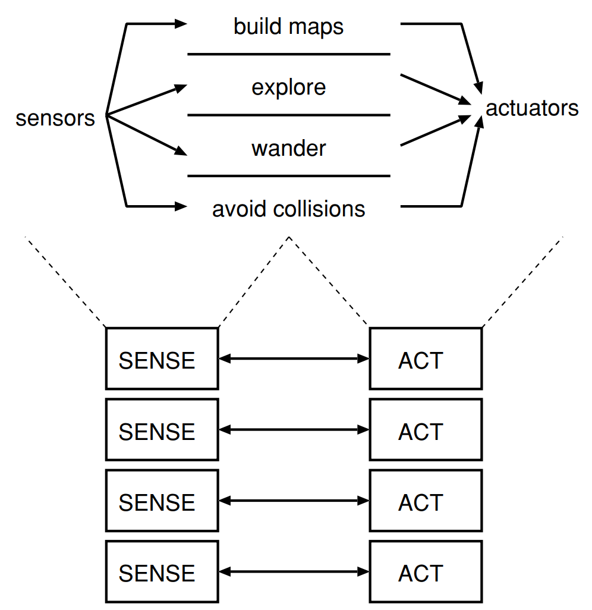

# Exercises - Chapter 4

## The Reactive Paradigm

---

1. Define the reactive paradigm in terms of a.) the SENSE, PLAN, and ACT primitives, and b.) sensing organization.

    

    - The Reactive Paradigm literally threw away the PLAN component of the SENSE, PLAN, ACT triad, as shown in Fig. The SENSE and ACT components are tightly coupled into behaviors, and all robotic activities emerge as the result of these behaviors operating either in sequence or concurrently.
    - The S-A organization does not specify how the behaviors are coordinated and controlled; this is an important topic addressed by architectures.
    - Sensing in the Reactive Paradigm is local to each behavior, or behavior-specific. Each behavior has its own dedicated sensing. In many cases, this is implemented as one sensor and perceptual schema per behavior. But in other cases, more than one behavior can take the same output from a sensor and process it differently (via the behavior’s perceptual schema).
    - In terms of sensing organization, the reactive paradigm typically involves organizing sensors and actuators in a way that allows the system to respond quickly and effectively to changes in the environment. This might involve designing sensors to be distributed throughout the system, or using specialized sensors that are optimized for particular tasks.

1. Describe the difference between robot control using a horizontal decomposition and a vertical decomposition.

    - Under a vertical decomposition, an agent starts with primitive survival behaviors and evolves new layers of behaviors which either reuse the lower, older behaviors, inhibit the older behaviors, or create parallel tracks of more advanced behaviors. The parallel tracks can be thought of layers, stacked vertically. Each layer has access to sensors and actuators independently of any other layers. If anything happens to an advanced behavior, the lower level behaviors would still operate. This return to a lower level mimics degradation of autonomous functions in the brain. Functions in the brain stem (such as breathing) continue independently of higher order functions (such as counting, face recognition, task planning), allowing a person who has brain damage from a car wreck to still breathe, etc.

2. List the characteristics of a reactive robotic system.

    - Reactive robotic system decomposes functionality into behaviors, which tightly couple perception to action without the use of intervening abstract (global) representations. This is a broad, vague definition. Over the years, the reactive paradigm has acquired several connotations and characteristics from the way practitioners have used the paradigm.
    - The primary connotation of a reactive robotic system is that it executes rapidly. The tight coupling of sensing and acting permits robots to operate in real-time, moving at speeds of 1-2 cm per second. Behaviors can be implemented directly in hardware as circuits, or with low computational complexity algorithms (O(n)). This means that behaviors execute quickly regardless of the processor.
    - A secondary connotation is that reactive robotic systems have no memory, limiting reactive behaviors to what biologists would call pure stimulus-response reflexes.  In practice, many behaviors exhibit a fixed-action pattern type of response, where the behavior persists for a short period of time without the direct presence of the stimulus. The main point is that behaviors are controlled by what is happening in the world, duplicating the spirit of innate releasing mechanisms, rather than by the program storing and remembering what the robot did last. The examples in the chapter emphasize this point. The five characteristics of almost all architectures that follow the Reactive Paradigm are:
      - Robots are situated agents operating in an ecological niche.
      - Behaviors serve as the basic building blocks for robotic actions, and the overall behavior of the robot is emergent.
      - Only local, behavior-specific sensing is permitted.
      - These systems inherently follow good software design principles.
      - Animal models of behavior are often cited as a basis for these systems or a particular behavior.,

3. Describe the differences between two dominant methods for combining behaviors in
a reactive architecture, subsumption and potential field summation.

1. Evaluate the subsumption architecture in terms of: support for modularity, niche
targetability, ease of portability to other domains, robustness.

1. Evaluate potential field methodologies in terms of: support for modularity, niche
targetability, ease of portability to other domains, robustness.

1. What is the difference between the way the term “internal state” was used in ethology
and the way “internal state” means in behavioral robotics?

1. Diagram Level 2 in the subsumption example in terms of behaviors.

2. When would an exponentially increasing repulsive field be preferable over a linear
increasing repulsive field?

1.  Suppose you were to construct a library of potential fields of the five primitives. What
parameters would you include as arguments to allow a user to customize the fields?

1.  Use a spreadsheet, such as Microsoft Excel, to compute various magnitude profiles.

2.  Return to Fig. 4.17. Plot the path of the robot if it started in the upper left corner.

3.  Consider the Khepera robot and its IR sensors with the RUNAWAY behavior instantiated for each sensor as in the example in Fig. 4.19. What happens if an IR breaks and
always returns a range reading of N, meaning an obstacle is Ncm away? What will
be the emergent behavior? and so on. Can a reactive robot notice that it is malfunctioning? Why or why not?

1.  How does the Reactive Paradigm handle the frame problem and the open world assumption?

2.  An alternative RUNAWAY behavior is to turn 90 degree (either left or right, depending on
whether its “left handed” or “right handed” robot) rather than 180 degree. Can this be
represented by a potential field?

1.  Using rules, or if-then statements, is a method for representing and combining programming units which are often called behaviors; for example “if OBSTACLE-ONLEFT and HEADING-RIGHT, then IGNORE.” Can the layers in subsumption for
hall-following be written as a series of rules? Can the potential fields? Are rules
equivalent to these two methods? Do you think rules are more amenable to good
software engineering practices?

1.  Some researchers consider random wandering as a primitive potential field. Recall
that random wandering causes the robot to periodically swap to a new vector with a
random direction and magnitude. How can a wander field be represented? Does the
array of the field represent a physical area or time? Unlike regular potential fields, the
vector is computed as a function of time, every nminutes, rather than on the robot’s
relationship to something perceivable in the world.

1.  [Programming] Design and implement potential fields:
- Construct a potential field to represent a “move through door” behavior from
primitive potential fields. Why won’t a simple attractive field work? ANS: if the
robot is coming from a side, it will graze the door frame because the robot is not a
point, it has width and limited turning radius.
- What happens if a person is exiting the door as the robot enters? Design an appropriate “avoid” potential field, and show the emergent potential field when AVOID
and MOVE-THRU-DOOR are activated at the same time.
- Simulate this using the Khepera simulator for Unix systems found at:
http://www.k-team.com.
- Run this on a real khepera.

1.  [Programming] Program two versions of a phototropic behavior using the Khepera simulator. Both versions should use the same motor schema, an attractive field, but different perceptual schemas. In one version, the perceptual schema processes light from a single
sensor and the behavior is instantiated 8 times. In the second version, the perceptual
schema processes light from all sensors and returns the brightest. Set up five interesting “worlds” in the simulator with different placements of lights. Compare the
emergent behavior for each world.

1.  [Digital Circuits] 
For readers with a background in digital circuits, build one or more of the simple creatures in Flynn and Jones’ Mobile Robots: Inspiration to Implementation 76 using a Rug Warrior kit.