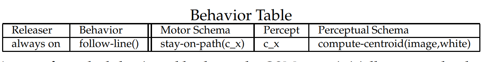
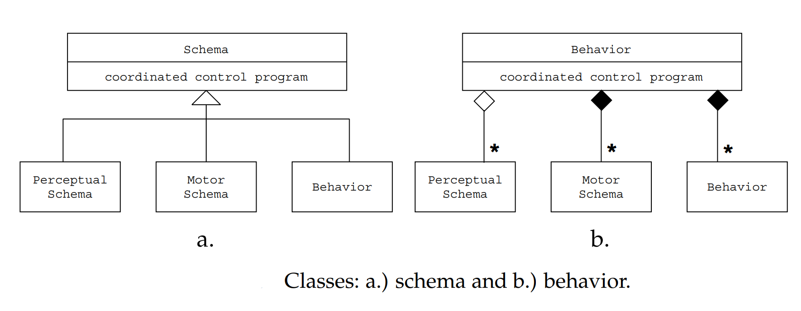
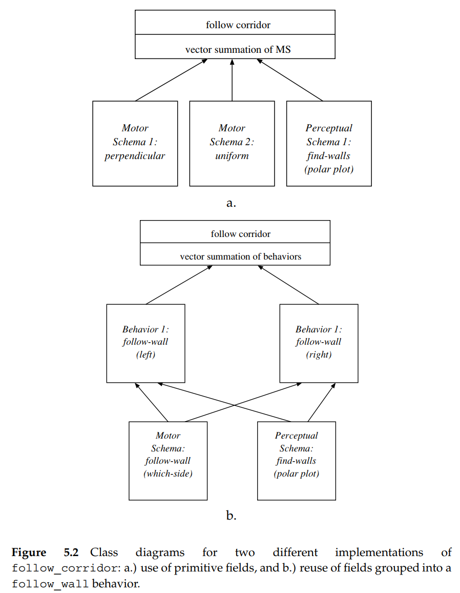

1. What is the difference between a primitive and an abstract behavior?

   *  **Primitive behavior** is composed of only one perceptual schema and one motor schema; there is no need to have any coordinated control program. Primitive behaviors can be thought of being monolithic, where they do only one (“mono”) thing. Because they are usually a simple mapping from stimulus to response, they are often programmed as a single method, not composed from multiple methods or objects. The concept of Perceptual and Motor Schema is there, but hidden for the sake of implementation. Behaviors which are assembled from other behaviors or have multiple perceptual schema and motor schema will be referred to as abstract behaviors, because they are farther removed from the sensors and actuators than a primitive behavior. The use of the term **abstract behavior** should not be confused with an abstract class in OOP.
   *  Primitive behaviors and abstract behaviors are two different types of behaviors that can be used in robotic systems.
   *  Primitive behaviors are basic, low-level behaviors that are directly controlled by sensor inputs and have a well-defined set of actions. They are typically simple, atomic actions that the robot can perform, such as avoiding obstacles, following a line, or approaching a goal. Primitive behaviors are used to handle specific, well-defined tasks and are easy to implement, test and debug.
   *  Abstract behaviors, on the other hand, are higher-level behaviors that are built on top of primitive behaviors. They are more complex, involving multiple primitive behaviors and decision-making processes. Abstract behaviors can perform more complex tasks such as navigating through a maze, or interacting with humans. They are more difficult to implement, test and debug, but can handle more complex and dynamic environments.
   *  In summary, the main difference between primitive and abstract behaviors is that primitive behaviors are simple, low-level behaviors that are directly controlled by sensor inputs and have a well-defined set of actions, while abstract behaviors are higher-level behaviors that are built on top of primitive behaviors and can perform more complex tasks.

2. Define the following terms:

Imagine you have a robot and you want it to do different things depending on the situation. For example, if it sees an obstacle in front of it, it should avoid it, and if it sees a line on the ground it should follow it.

- **behavior table:** 
    
    A behavior table is like a list of instructions that tells the robot what to do in different situations. It's like a flow chart, where each box represents a different behavior and the arrows show how the robot should move from one behavior to another.

    In terms of expressing the behaviors for a task, it is often advantageous to construct a behavior table as one way of at least getting all the behaviors on a  single sheet of paper. The releaser for each behavior is helpful for confirming  that the behaviors will operate correctly without conflict (remember, accidently programming the robotic equivalent of male sticklebacks from Ch. 3  is undesirable). It is often useful for the designer to classify the motor schema  and the percept. For example, consider what happens if an implementation  has a purely reflexive move-to-goal motor schema and an avoid-obstacle behavior. What happens if the avoid-obstacle behavior causes the robot to lose  perception of the goal? Oops, the perceptual schema returns no goal and the  move-to-goal behavior is terminated! Probably what the designer assumed  was that the behavior would be a fixed-action pattern and thereby the robot  would persist in moving toward the last known location of the goal.

    

    

- causal chain

    A causal chain is like a chain of events that happen one after the other. It's like a story, where each event is linked to the next event. In our robot example, the robot sees an obstacle and then it avoids it.

    The causal chain  is critical, because it embodies the coordination control program logic just as  a FSA does. It can be implemented in the same way. In NLP, scripts allow  the computer to keep up with a conversation that may be abbreviated. For  example, consider a computer trying to read and translate a book where the  main character has stopped in a restaurant. Good writers often eliminate all  the details of an event to concentrate on the ones that matter. This missing,  but implied, information is easy to extract. Suppose the book started with  “John ordered lobster.” This is a clue that serves as an index into the current or relevant event of the script (eating at a restaurant), skipping over past  events (John arrived at the restaurant, John got a menu, etc.). They also focus  the system’s attention on the next likely event (look for a phrase that indicates John has placed an order), so the computer can instantiate the function  which looks for this event. If the next sentence is “Armand brought out the  lobster and refilled the white wine,” the computer can infer that Armand is  the waiter and that John had previously ordered and received white wine,  without having been explicitly told.

- coordinated control program

    A coordinated control program is like a conductor of an orchestra. It takes all the different instructions from the behavior table and makes sure that the robot does the right thing at the right time. It's like a boss, who makes sure that everyone is doing their job correctly and that everything is running smoothly.

    The coordinated control program is a function that coordinates any methods or schemas in the derived class.  Three classes are derived from the Schema Class: Behavior, Motor Schema,  and Perceptual Schema. Behaviors are composed of at least one Perceptual  Schema and one Motor Schema; these schemas act as the methods for the  Behavior class. A Perceptual Schema has at least one method; that method takes sensor input and transforms it into a data structure called a percept. A  Motor Schema has at least one method which transforms the percept into a  vector or other form of representing an action. Since schemas are independent, the Behavior object acts as a place holder or local storage area for the  percept. The Perceptual Schema is linked to the sensor(s), while the Motor Schema is linked to the robot’s actuators. The sensors and actuators can  be represented by their own software classes if needed; this is useful when  working with software drivers for the hardware.

    

    

    To put it simply, a behavior table tells the robot what to do, a causal chain shows the order of the events and a coordinated control program makes sure that everything runs smoothly and in an orderly manner.

3. Can the perceptual schema and the motor schema for a behavior execute asynchronously, that is, have different update rates?

    Yes, the perceptual schema and the motor schema for a behavior can execute asynchronously, meaning they can have different update rates.

    Perceptual schema, also known as sensory processing, is responsible for processing sensor information, such as sensor readings from cameras, microphones, or infrared sensors, and updating the robot's internal state based on that information. The update rate for the perceptual schema will depend on the type of sensors used and the frequency at which they produce new data. For example, a camera sensor may produce new data at a higher rate than an infrared sensor.

    Motor schema, also known as actuation, is responsible for controlling the robot's actuators, such as wheels, arms, or grippers, and executing the actions specified by the behavior. The update rate for the motor schema will depend on the type of actuators used and the frequency at which they need to be updated to execute the desired actions. For example, a robot with high-speed wheels will require a higher update rate than a robot with slower wheels.

    In some cases, the update rate of the perceptual schema may be faster than the update rate of the motor schema. In such cases, the robot may have to buffer the sensor data and process it at the rate of the motor schema. In other cases, the update rate of the motor schema may be faster than the update rate of the perceptual schema, in which case the robot may have to use a prediction algorithm to estimate the sensor readings based on the previous sensor readings.

    In summary, the perceptual schema and the motor schema for a behavior can execute asynchronously, meaning they can have different update rates, and this depends on the type of sensors and actuators used and the frequency at which they produce new data or need to be updated to execute the desired actions.

4. Fig. 5.2 shows two methods of implementing a potential fields-based follow-corridor behavior. A third way is to have two instances of a move-away-from-wall (perpendicular) behavior with a move-parallel-to-wall behavior. What are the advantages and disadvantages of such an implementation?

    

    
    

    This method involves using two perpendicular forces, one on each side of the robot, to push the robot away from the walls of the corridor, while also using a parallel force to guide the robot along the center of the corridor.

    Advantages of this implementation include:

    * Increased robustness: By having two perpendicular forces, one on each side of the robot, the robot is less likely to get stuck in corners or against walls, as it can always move away from obstacles on either side.
    * Greater flexibility: The robot can navigate through corridors of varying widths, as the perpendicular forces can be adjusted to adapt to the width of the corridor.
    * Better sensing: By using two instances of a move-away-from-wall behavior, the robot can sense the walls on both sides and can adjust its trajectory accordingly.

    Disadvantages of this implementation include:

    * Increased complexity: The use of three different behaviors (two perpendicular and one parallel) increases the complexity of the implementation, making it more difficult to design, test, and debug.
    * Increased computational requirements: The use of three different behaviors increases the computational requirements of the implementation, which may be a concern for systems with limited resources.
    * Greater susceptibility to noise: Using two instances of a move-away-from-wall behavior may be more susceptible to noise in the sensor data, as the robot may react to phantom obstacles if the sensor readings are not accurate.

    In conclusion, the third way of implementing a potential fields-based follow-corridor behavior has its advantages such as increased robustness, greater flexibility and better sensing but also has its disadvantages such as increased complexity, increased computational requirements and greater susceptibility to noise.
    
5. List and describe the steps in designing a reactive system.

    Designing a reactive system can be broken down into the following steps:

    5.1. Define the problem: The first step in designing a reactive system is to clearly define the problem that the system is supposed to solve. This includes identifying the goals and objectives of the system, as well as the constraints and limitations of the system.

    5.2. Identify the sensors and actuators: The next step is to identify the sensors and actuators that the system will use to perceive and act in the environment. This includes selecting the appropriate sensors and actuators for the task, as well as determining how the data from the sensors will be used to control the actuators.
    
    5.3. Design the reactive behaviors: The third step is to design the reactive behaviors that the system will use to react to the environment. This includes identifying the conditions that will trigger each behavior, as well as the actions that the system will take in response to those conditions.

    5.4. Implement the system: After the behaviors are designed, the next step is to implement the system. This includes writing the code that will run the system, as well as configuring the sensors and actuators.

    5.5. Test the system: The fifth step is to test the system to ensure that it is working correctly. This includes running simulations and conducting experiments to evaluate the performance of the system.

    5.6. Optimize the system: The final step is to optimize the system based on the results of the testing. This includes adjusting the parameters of the system, such as the weights of the potential fields, and fine-tuning the system to improve its performance.

6. Consider the Pick Up the Trash example in Sec. 5.5.2. The example assumed the arena was empty except for walls, cans, and trash cans. What would happen if there were chairs and tables present? Could the gripper accidently scoop a chair or table leg? How would the system react? What changes, if any, would need to be made to the behavior table and FSA?

7. Solve the 1994 International Association for Unmanned Systems Unmanned Ground Vehicle problem using STRIPS (Ch. 2). Be sure to include a world model and a difference table.y

8. Solve the 1994 AAAI Pick Up the Trash problem using STRIPS (Ch. 2). Be sure to include a world model and a difference table.

9.  How is defining a robot’s behaviors linked to the robot’s ecological niche?y

10. What is special about a primitive behavior in terms of perceptual and motor schema?y

11. Construct a Behavioral Table of the behaviors needed for a robot to move from room to room.

12. What are the two main deficits encountered when designing and implementing reactive robotic systems?

13. Make up a task for a robot to complete. Describe what each of the 7 steps of the design methodology would require you to do to complete the task.

14. Describe the two methods for assembling primitive behaviors into abstract behaviors: finite state automata and scripts.

15. Assume that the CSM robot had been wider and needed to use an avoid-obstacle behavior. Make a Behavior Table to include this new behavior.y

16. Assuming the state of the robot in question 1, describe how the coordinated control program should handle concurrent behaviors.

17. Recall how some mammals freeze when they see motion (an affordance for a predator) in an attempt to become invisible, and persist in this behavior until the predator is very close, then flee. Define this behavior using Behavior Tables.

18. Suppose the competition course described in Section 5.4 has been modified so that a hay bale can be placed directly on the white line. The robot must move around the bale and rejoin the line on the other side. Create a behavior table that not only follows the line but correctly responds to the bale so that it can continue following the line.

19. [World Wide Web] Search the web for the International Association for Unmanned Systems competition home page and briefly describe three unmanned vehicle projects linked to the IAUS site

20. [World Wide Web] Identify at least 5 robot competitions, and for each describe the basic task. Can the task be accomplished with a reactive robot? Why or why not?

21. [Programming] Using Rug Warrior kits, Lego Mindstorms kits, or similar robotics tools, implement your own schools version of an IAUS Unmanned Ground Robotics Competition. Your class should decide on the course, the course objectives, rules, and prizes (if any). Groups should not begin construction of their robot without first describing the steps involved in designing a reactive behavioral system for the task at hand.

22. [Programming] Write a script in pseudo-code for following a hallway. Consider that the robot may start in a hallway intersection facing away from the hallway it is supposed to take. Also the robot might start in the middle of a hall facing a wall, rather than having forward point to the long axis of the hall.

23. [Programming] The Pick Up the Trash competitions were a bit different than actually presented in this book. For example, the robots were actually permitted to cache up to three cans before going to the trash can, and the robots could go after white Styrofoam cups as trash. How would you integrate this into:
    a. the FSA and
    b. the script described in the book?

24. [Programming] Could the exception handling sub-scripts for picking up trash be implemented with the exception handling functionality provided by Ada or C++?

25. [Advanced Reading] Read Rodney Brooks’ one paragraph introduction to Chapter 1 in Cambrian Intelligence 28 on the lack of mathematics in behavioral robotics. Now consider the behavior of the CSM robot around white shoes and dandelions. Certainly it would be useful to have theories which can prove when a behavioral system will fail. Is it possible?
