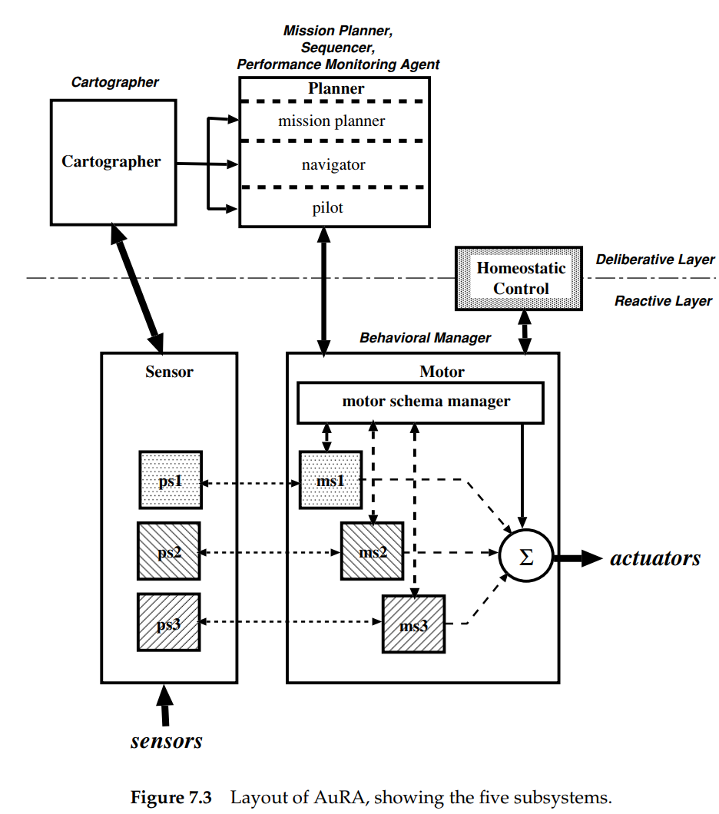
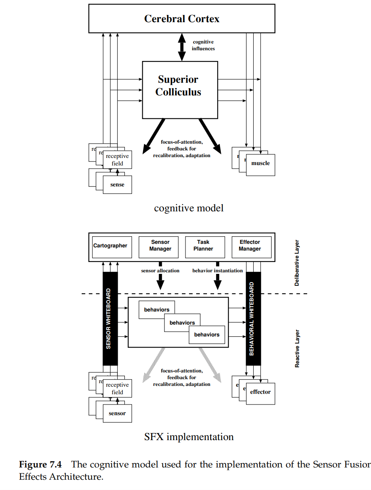
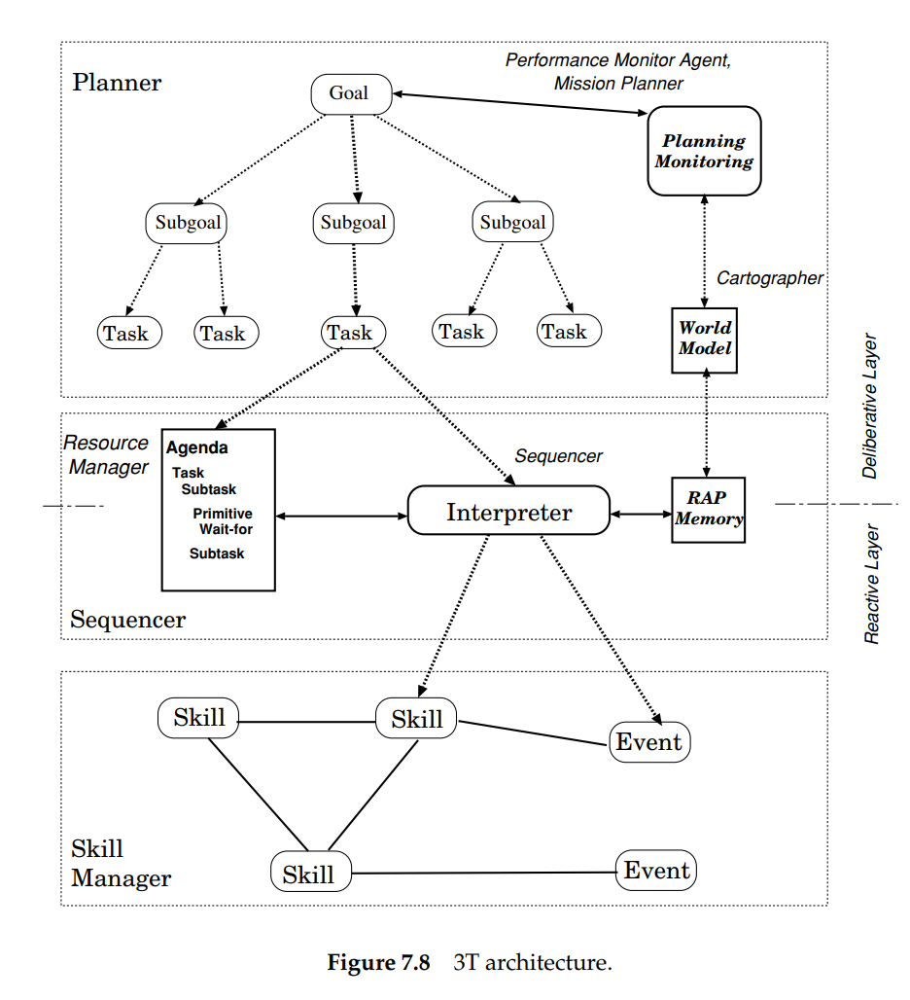
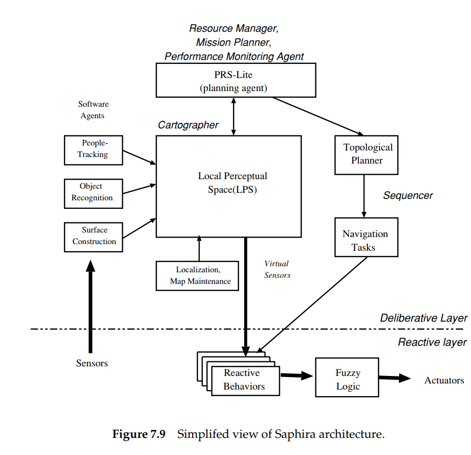
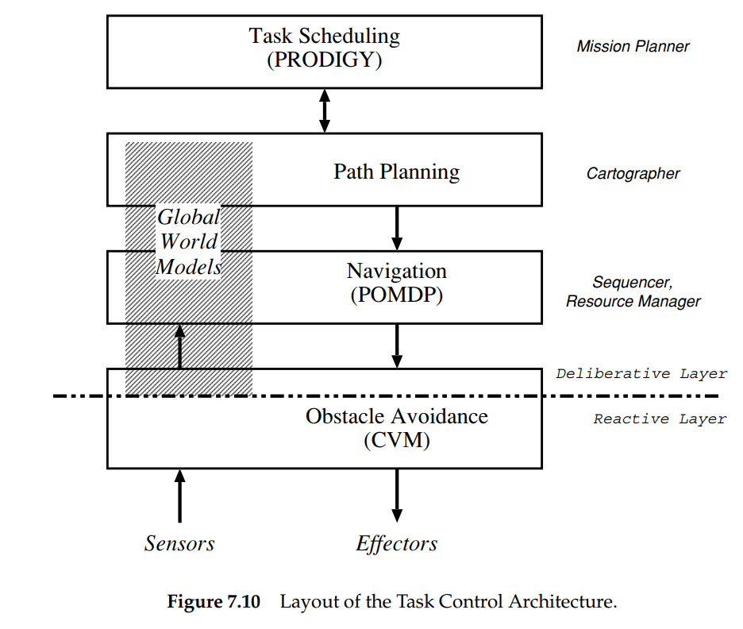

1. Describe the Hybrid paradigm in terms of: a. sensing, acting, and planning, and b. sensing organization.

    A. The Hybrid paradigm in terms of sensing, acting, and planning refers to the integration of multiple methods to accomplish a task. This approach involves combining different modalities of sensing, like computer vision, touch, and auditory, along with the physical actions of the robot and the planning of the overall task. This integration allows for a more comprehensive understanding of the environment and increases the efficiency of the robot's actions.

    B. In terms of sensing organization, the Hybrid paradigm involves the use of multiple sensors and their data to create a holistic picture of the environment. These sensors work together to gather information about the surroundings and provide the robot with multiple perspectives, allowing for a more complete representation of the environment. The data from these sensors is then used to inform the robot's actions and decisions, ensuring that it is able to make the most informed decisions possible.

2. Decide whether each of the following is deliberative or behavioral: path planning, resource allocation, map making, avoiding obstacles, navigation.

    **Path planning:** Deliberative
    **Resource allocation:** Deliberative
    **Map making:** Deliberative
    **Avoiding obstacles:** Behavioral
    **Navigation:** Behavioral

Path planning is considered deliberative because it involves decision making and planning a specific path to reach a desired goal. It requires information about the environment and the robot's capabilities to determine the best course of action.

Resource allocation is also considered deliberative because it involves making decisions about the distribution of resources such as time, energy, or memory. It requires considering the robot's current state and its future goals in order to make informed decisions about resource distribution.

Map making is deliberative because it involves actively collecting information about the environment and updating a map in order to create an accurate representation of the world. It requires making decisions about what information to collect and how to store it in a useful manner.

Avoiding obstacles is considered behavioral because it is reactive and does not involve planning or decision making. The robot simply reacts to the presence of obstacles by adjusting its path to avoid them.

Navigation is also considered behavioral because it involves following a set of rules or pre-determined path to reach a goal. It does not involve making decisions or planning, but rather follows a set procedure.

3. Name and evaluate the following architectures in terms of support for modularity, niche targetability, ease of portability to other domains, robustness. a. AuRA b. SFX c. 3T d. Saphira e. TCA

**AuRA (Architecture for Unmanned Robotic Agents):**

    Modularity: High, as AuRA is designed to support multiple levels of modularity, including functional modularity, behavioral modularity, and architectural modularity.
    Niche targetability: Moderate, as AuRA is a general-purpose architecture and is not specifically targeted towards a particular niche.
    Portability: High, as AuRA is designed to be easily ported to other domains.
    Robustness: High, as AuRA is designed with robustness in mind, including error handling and recovery mechanisms.

    

**SFX:**

    Modularity: High, as SFX supports modularity through the use of situation-based modules that can be customized for different domains.
    Niche targetability: High, as SFX is designed to be highly targetable towards particular niches, such as educational or research applications.
    Portability: Moderate, as SFX is designed for a particular set of applications and may require modifications to be ported to other domains.
    Robustness: Moderate, as SFX does not have a strong focus on robustness, and may not be as robust as other architectures.
    

    

**3T (Three Tier Architecture):**

    Modularity: High, as 3T supports modularity through the use of three separate tiers: perception, decision, and action.
    Niche targetability: Moderate, as 3T is a general-purpose architecture and is not specifically targeted towards a particular niche.
    Portability: High, as 3T is designed to be easily portable to other domains.
    Robustness: High, as 3T is designed with robustness in mind, including error handling and recovery mechanisms.

    

**Saphira**:

    Modularity: High, as Saphira supports modularity through the use of reusable components and architecture-level abstractions.
    Niche targetability: High, as Saphira is designed to be highly targetable towards particular niches, such as autonomous vehicles or autonomous aerial systems.
    Portability: Moderate, as Saphira is designed for a particular set of applications and may require modifications to be ported to other domains.
    Robustness: High, as Saphira is designed with robustness in mind, including error handling and recovery mechanisms.

    

    
**TCA (Three-layer Control Architecture):**

    Modularity: High, as TCA supports modularity through the use of three separate layers: perception, control, and action.
    Niche targetability: Moderate, as TCA is a general-purpose architecture and is not specifically targeted towards a particular niche.
    Portability: High, as TCA is designed to be easily portable to other domains.
    Robustness: High, as TCA is designed with robustness in mind, including error handling and recovery mechanisms.

    

4. Why do behavioral management and performance monitoring require global knowledge?

Behavioral management and performance monitoring require global knowledge because the robot's overall behavior is not determined by just one isolated component, but is instead the result of the interactions between all of its components. To ensure that the robot is performing optimally, it is important to have a comprehensive understanding of the behavior of all parts of the system, including sensor inputs, decision-making processes, and actuator outputs. This information can only be obtained by collecting data from all parts of the system and analyzing it in a holistic manner. In order for the robot to operate effectively, it must be able to identify and respond to changes in the environment and in its own behavior. This requires a global understanding of the state of the system in order to make informed decisions about how to modify its behavior.

5. How does the Hybrid Paradigm address the frame problem and the open world?

The Hybrid Paradigm addresses the frame problem and the open world by incorporating both deliberative and behavioral approaches to decision-making and action execution. Deliberative approaches allow for explicitly representing and reasoning about goals, plans, and beliefs, which can handle the frame problem by providing a structured way to represent the effects of actions and update beliefs. Behavioral approaches provide a reactive, low-level mechanism for action execution, which can handle the open world by dealing with unexpected events and changing conditions in real-time.

The Hybrid Paradigm combines these two approaches to provide a flexible and robust solution to the frame problem and the open world. The deliberative system provides a high-level reasoning mechanism, while the behavioral system provides a low-level mechanism for action execution. The two systems work together to achieve the robot's goals, with the deliberative system guiding the overall behavior and the behavioral system responding to the changing environment in real-time. This combination of approaches allows the Hybrid Paradigm to deal with both the frame problem and the open world in a flexible and robust manner.

6. List the five basic components of a Hybrid architecture.

The five basic components of a Hybrid architecture are:

    Sensing: A system for perceiving and interpreting sensory inputs from the environment.

    Reasoning: A system for combining and processing information from the sensing system to derive higher-level abstractions and models of the environment.

    Planning: A system for generating and selecting high-level plans based on the state of the environment, the capabilities of the robot, and the goals of the system.

    Acting: A system for controlling the robot’s physical behavior based on the selected plan.

    Monitoring: A system for monitoring the robot’s state and performance and providing feedback to the reasoning system to improve future planning and control decisions.

7. Describe the difference between managerial, state hierarchy, and model-oriented styles of Hybrid architectures and give one example of each.

The managerial style of Hybrid architectures focuses on the management of the behaviors of the robot. In this style, the behaviors are assigned a priority and are managed by a central entity that ensures that the behaviors are executed in a manner that ensures the overall goal of the robot. An example of this style is the Subsumption architecture.

The state hierarchy style of Hybrid architectures focuses on the organization of the behaviors into a state machine. In this style, the behaviors are organized into states and transitions between the states. The state machine is responsible for ensuring that the appropriate behaviors are executed based on the current state of the robot. An example of this style is the Statechart architecture.

The model-oriented style of Hybrid architectures focuses on modeling the environment and the behavior of the robot in terms of a set of rules or models. In this style, the behaviors are generated from the models and the models are updated based on the sensor data. An example of this style is the Belief-Desire-Intention architecture.

Each of the styles has its own strengths and weaknesses, and the choice of which style to use depends on the specific requirements of the robot and the application.

8. Describe the use of state (Past, Present, Future) to define behaviors and deliberative responsibilities in a state-hierarchy architecture.

In a state-hierarchy architecture, the use of state (Past, Present, Future) helps to define behaviors and deliberative responsibilities. The Past state refers to the previous actions taken by the robot, including sensor readings and other inputs. The Present state refers to the current conditions and events taking place, such as the current position of the robot, and any objects or obstacles in its environment. The Future state refers to the desired or predicted outcomes that the robot is trying to achieve.

By using the Past, Present, and Future states, the state-hierarchy architecture can create a more sophisticated and efficient way of defining behaviors and deliberative responsibilities. For example, the Past state can be used to inform the robot of its current capabilities and limitations, the Present state can be used to guide the robot's actions in real-time, and the Future state can be used to plan for future events or goals. This allows the robot to make more informed decisions and to respond to changing situations in a more adaptive and flexible manner.

9.  [Advanced Reading] Search for technical papers on Cog, Rodney Brooks’ controversial humanoid robot project. What paradigm best describes the architecture and why?

The Cog Project is an ongoing project that began in the 1990s with the goal of building a humanoid robot that can perform human-like tasks. The Cog Project is based on the belief that robots can be designed to think, perceive, and act like humans by modeling the human brain.

The architecture of the Cog Project is best described as a hybrid paradigm. The hybrid paradigm combines the deliberative (goal-directed) approach with the reactive (behavioral) approach. The hybrid architecture is well-suited for building humanoid robots as it allows for the combination of low-level, reactive behaviors with high-level, deliberative reasoning. This allows for the robot to respond quickly to changes in its environment, while still being able to plan and make decisions based on its goals.

The hybrid paradigm is well-suited for the Cog Project because it allows for a flexible and modular approach to building the robot. Different parts of the architecture can be changed or improved without affecting the overall system. The use of a state hierarchy also allows for the robot to have a more flexible and adaptive response to its environment.

In conclusion, the hybrid paradigm provides a good fit for the Cog Project as it allows for a flexible, modular, and adaptive approach to building a humanoid robot.

10. [Advanced Reading] Look up technical reports on Shakey. Compare Shakey with the Hybrid architectures. Now consider the possible impact of the radical increases in processing power since the 1960’s. Do you agree or disagree with the statement that Shakey would be as capable as any Hybrid if it were built today? Justify your answer. (This question was posed by Tom Garvey of SRI.)

Shakey the Robot was one of the earliest robots and was built in the 1960s. It was a box-shaped robot that used sensors to move around and complete tasks. It used a symbolic reasoning system and a rule-based system for decision making.

Compared to the Hybrid architectures, Shakey's architecture was more symbolic reasoning-based and lacked the integration of behavioral and deliberative responsibilities. The Hybrid paradigm has been developed since Shakey and incorporates a more dynamic, flexible and modular system that is better suited to dealing with the uncertainty of real-world environments.

In terms of the impact of increased processing power, it is true that the increase in computational power would have greatly improved Shakey's capabilities. However, it is not enough to simply have increased processing power. The architecture itself needs to be able to take advantage of this increase in power and the Hybrid architecture provides a more suitable framework for this.

Overall, while Shakey would have been improved by the increase in processing power, it is unlikely that it would be as capable as the Hybrid architectures as it lacks the flexibility and integration of behavioral and deliberative responsibilities that the Hybrid paradigm provides.

11.  [Advanced Reading] Read more about the Saphira architecture in “The Saphira Architecture for Autonomous Mobile Robots” by Kurt Konolige and Karen Myers in Artificial Intelligence and Mobile Robots. They describe the system built for a demonstration for the TV special, Scientific American Frontiers. Summarize the behaviors and agents used. How would the same tasks be accomplished using AuRA, SFX, 3T, or TCA?

The Saphira architecture for autonomous mobile robots is a hybrid architecture that uses a combination of deliberative and behavioral approaches to accomplish tasks. The system was built for a demonstration for the TV special, Scientific American Frontiers and it consisted of several behaviors and agents. The behaviors used were obstacle avoidance, mapping, exploration, and following the leader. The agents used were the perception agent, the planning agent, and the execution agent.

If the same tasks were accomplished using AuRA, SFX, 3T, or TCA, the approach would be slightly different. AuRA is a hybrid architecture that uses a state hierarchy to define behaviors and deliberative responsibilities. SFX is a hybrid architecture that uses a modular approach to support real-time execution and robustness. 3T is a hybrid architecture that uses a manager-based approach to allow for easier portability to other domains. TCA is a hybrid architecture that uses a model-oriented approach to support ease of programming.

In conclusion, the Saphira architecture for autonomous mobile robots uses a hybrid approach that combines deliberative and behavioral approaches to accomplish tasks. Other hybrid architectures, such as AuRA, SFX, 3T, and TCA, would approach the same tasks differently based on their unique approaches to hybrid architectures.