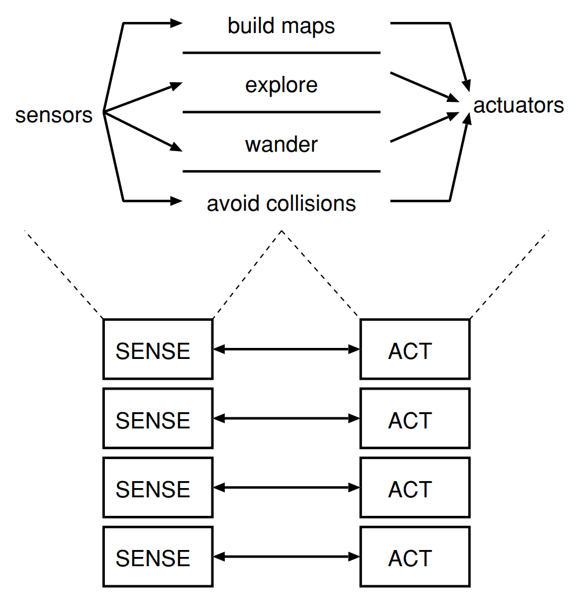
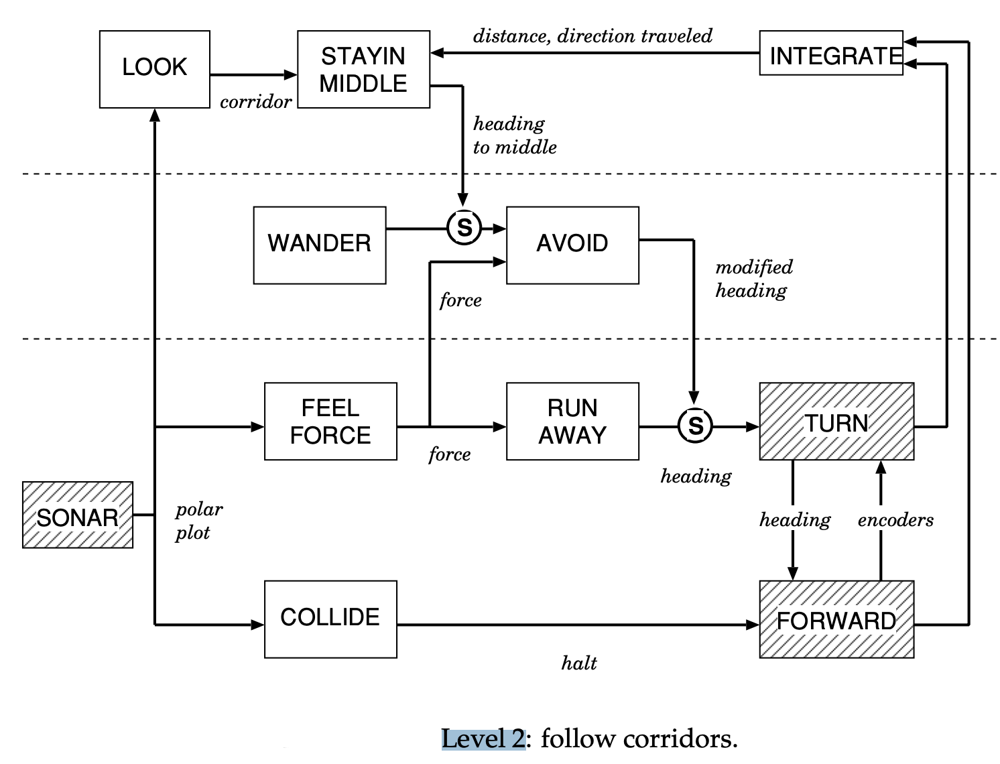
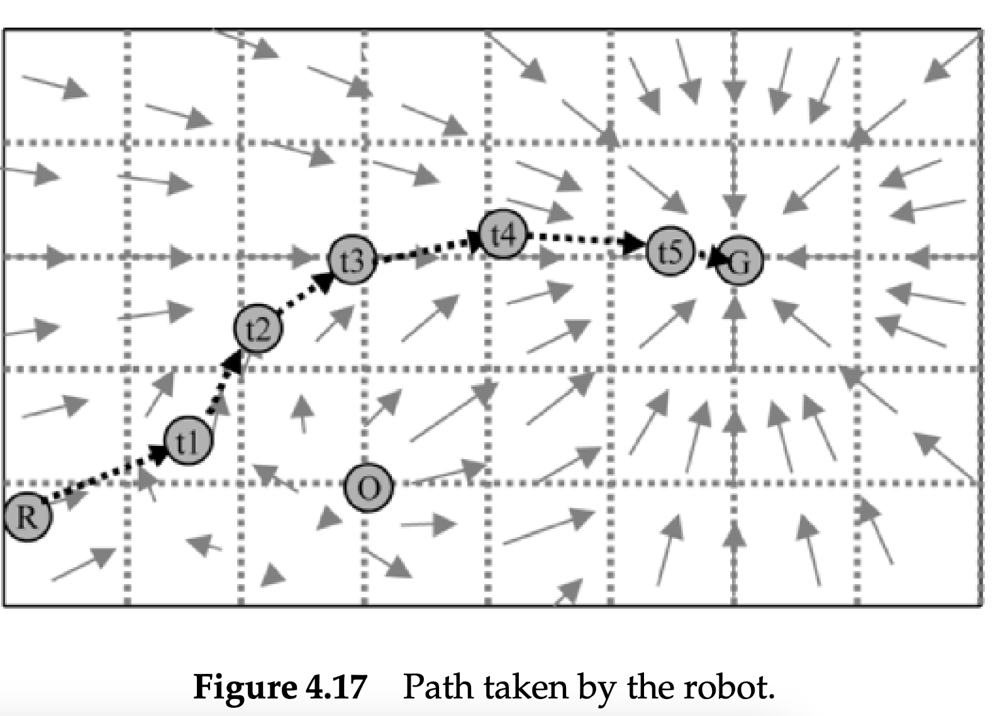
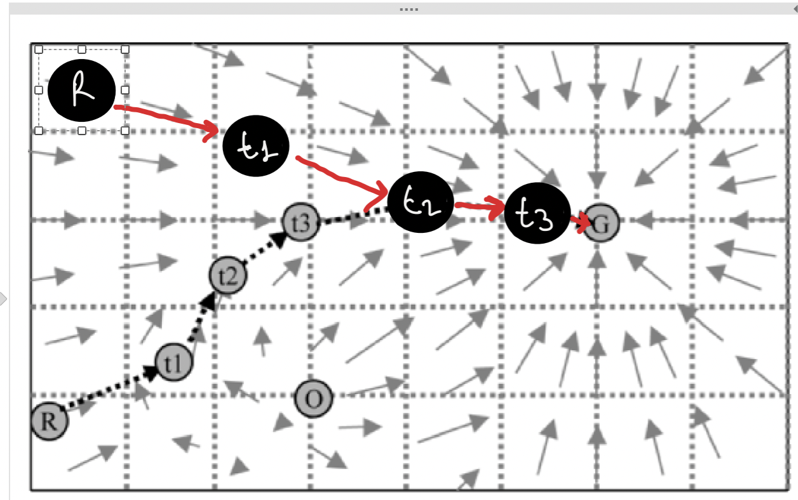
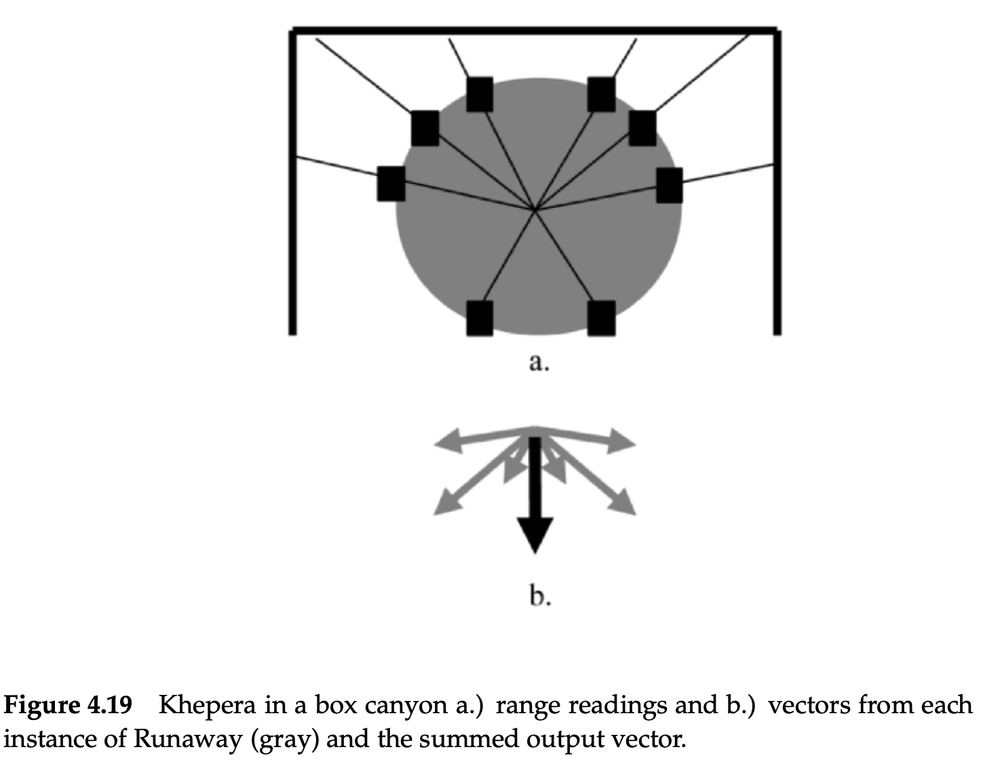

# Exercises - Chapter 4

## The Reactive Paradigm

---

1. Define the reactive paradigm in terms of a.) the SENSE, PLAN, and ACT primitives, and b.) sensing organization.

<p align="center">
    </p>

- The Reactive Paradigm literally threw away the PLAN component of the SENSE, PLAN, ACT triad, as shown in Fig. The SENSE and ACT components are tightly coupled into behaviors, and all robotic activities emerge as the result of these behaviors operating either in sequence or concurrently.
- The S-A organization does not specify how the behaviors are coordinated and controlled; this is an important topic addressed by architectures.
- Sensing in the Reactive Paradigm is local to each behavior, or behavior-specific. Each behavior has its own dedicated sensing. In many cases, this is implemented as one sensor and perceptual schema per behavior. But in other cases, more than one behavior can take the same output from a sensor and process it differently (via the behavior’s perceptual schema).
- In terms of sensing organization, the reactive paradigm typically involves organizing sensors and actuators in a way that allows the system to respond quickly and effectively to changes in the environment. This might involve designing sensors to be distributed throughout the system, or using specialized sensors that are optimized for particular tasks.

2. Describe the difference between robot control using a horizontal decomposition and a vertical decomposition.

    - Under a vertical decomposition, an agent starts with primitive survival behaviors and evolves new layers of behaviors which either reuse the lower, older behaviors, inhibit the older behaviors, or create parallel tracks of more advanced behaviors. The parallel tracks can be thought of layers, stacked vertically. Each layer has access to sensors and actuators independently of any other layers. If anything happens to an advanced behavior, the lower level behaviors would still operate. This return to a lower level mimics degradation of autonomous functions in the brain. Functions in the brain stem (such as breathing) continue independently of higher order functions (such as counting, face recognition, task planning), allowing a person who has brain damage from a car wreck to still breathe, etc.

3. List the characteristics of a reactive robotic system.

    - Reactive robotic system decomposes functionality into behaviors, which tightly couple perception to action without the use of intervening abstract (global) representations. This is a broad, vague definition. Over the years, the reactive paradigm has acquired several connotations and characteristics from the way practitioners have used the paradigm.
    - The primary connotation of a reactive robotic system is that it executes rapidly. The tight coupling of sensing and acting permits robots to operate in real-time, moving at speeds of 1-2 cm per second. Behaviors can be implemented directly in hardware as circuits, or with low computational complexity algorithms (O(n)). This means that behaviors execute quickly regardless of the processor.
    - A secondary connotation is that reactive robotic systems have no memory, limiting reactive behaviors to what biologists would call pure stimulus-response reflexes.  In practice, many behaviors exhibit a fixed-action pattern type of response, where the behavior persists for a short period of time without the direct presence of the stimulus. The main point is that behaviors are controlled by what is happening in the world, duplicating the spirit of innate releasing mechanisms, rather than by the program storing and remembering what the robot did last. The examples in the chapter emphasize this point. The five characteristics of almost all architectures that follow the Reactive Paradigm are:
      - Robots are situated agents operating in an ecological niche.
      - Behaviors serve as the basic building blocks for robotic actions, and the overall behavior of the robot is emergent.
      - Only local, behavior-specific sensing is permitted.
      - These systems inherently follow good software design principles.
      - Animal models of behavior are often cited as a basis for these systems or a particular behavior.,

4. Describe the differences between two dominant methods for combining behaviors in a reactive architecture, subsumption and potential field summation.

Rodney Brooks’ subsumption architecture is the most influential of the purely Reactive Paradigm systems. Part of the influence stems from the publicity  surrounding the very naturalistic robots built with subsumption. The term “behavior” in the subsumption architecture has a less precise  meaning than in other architectures. A behavior is a network of sensing and  acting modules which accomplish a task.

Four interesting aspects of subsumption in terms of releasing and control are:

    * Modules are grouped into layers of competence.
    * LAYERS CAN SUBSUME LOWER LAYERS
    * The use of internal state is avoided. 
    * A task is accomplished by activating the appropriate layer, which then  activates the lower layers below it, and so on. However, in practice, subsumption style systems are not easily taskable, that is, they can’t be ordered  to do another task without being reprogrammed.

The strength of a potential field can be a function of the stimulus, regardless of distance. Potential fields are actually easy to program, especially since the fields are  ego-centric to the robot. The visualization of the entire field may appear  to indicate that the robot and the objects are in a fixed, absolute coordinate  system, but they are not. The robot computes the effect of the potential field,  usually as a straight line, at every update, with no memory of where it was  previously or where the robot has moved.

In a reactive architecture, there are two dominant methods for combining behaviors: subsumption and potential field summation.

Subsumption is a method in which behaviors are arranged in a hierarchy, with each behavior at a lower level subsuming the behaviors above it. In this method, behaviors at lower levels have priority over behaviors at higher levels. For example, a behavior for avoiding obstacles would be at a lower level and would have priority over a behavior for reaching a goal. This means that if the robot encounters an obstacle, the obstacle avoidance behavior will take over and the robot will avoid the obstacle before continuing to move towards the goal.

Potential field summation, on the other hand, is a method in which behaviors are combined through the use of potential fields. A potential field is a scalar field that represents the influence of an object or a behavior on the robot's movement. Each behavior generates a potential field, and the robot's movement is determined by the sum of these potential fields. For example, a potential field generated by an obstacle would repel the robot, while a potential field generated by a goal would attract the robot. The robot's movement is determined by the balance of these opposing forces.

In summary, subsumption is a method in which behaviors are arranged in a hierarchy, with the lower-level behaviors having priority over higher-level behaviors, while potential field summation is a method in which behaviors are combined through the use of potential fields, with the robot's movement determined by the balance of opposing forces.

5. Evaluate the subsumption architecture in terms of: support for modularity, niche targetability, ease of portability to other domains, robustness.

Evaluating the subsumption architecture in terms of support for modularity, niche targetability, ease of portability to other domains, and robustness:

* **Support for modularity:** The subsumption architecture supports modularity by allowing behaviors to be arranged in a hierarchical structure. Each behavior can be developed and tested separately, and then integrated into the overall system. This makes it easy to add or remove behaviors, and to modify the system as needed.

* **Niche targetability:** The subsumption architecture allows for niche targetability by allowing behaviors to be arranged in a hierarchy. Lower-level behaviors can be designed to handle specific tasks, while higher-level behaviors can be designed to handle more general tasks. This makes it easy to create specialized systems for specific applications.

* **Ease of portability to other domains:** The subsumption architecture is not as easily portable to other domains as other architectures. It is best suited for robotic systems that operate in real-time, sensor-based environments.

* **Robustness:** The subsumption architecture is robust just in the sense that it allows for multiple behaviors to operate simultaneously and provides a mechanism for resolving conflicts between behaviors. The hierarchical structure of the architecture ensures that lower-level behaviors can take priority over higher-level behaviors when necessary, which can help to prevent the robot from getting stuck in a loop or behaving in unexpected ways. Neither style of architecture explicitly addresses robustness, although in theory, if only a higher layer of a subsumption system failed, the lower layers should ensure robot survivability

Overall, subsumption architecture is a good choice for a robot system that operates in real-time, sensor-based environments and it is easy to add or remove behaviors, modify the system as needed, and create specialized systems for specific applications. However, it may not be as easily portable to other domains as other architectures.

6. Evaluate potential field methodologies in terms of: support for modularity, niche targetability, ease of portability to other domains, robustness.

Evaluating potential field methodologies in terms of support for modularity, niche targetability, ease of portability to other domains, and robustness:

* **Support for modularity:** Potential field methodologies support modularity by allowing behaviors to be represented by individual potential fields. Each potential field can be developed and tested separately, and then integrated into the overall system. This makes it easy to add or remove behaviors, and to modify the system as needed.

* **Niche targetability:** Potential field methodologies allow for niche targetability by allowing different potential fields to be used for different behaviors. For example, a potential field can be used to repel the robot from obstacles, while another potential field can be used to attract the robot towards a goal. This allows for the creation of specialized systems for specific applications.

* **Ease of portability to other domains:** Potential field methodologies are relatively easy to port to other domains. They can be used in a wide range of robotic systems, including those operating in both real-time and non-real-time environments.

* **Robustness:** Potential field methodologies are robust just in the sense that they allow for multiple behaviors to operate simultaneously and provide a mechanism for resolving conflicts between behaviors. The balance of opposing forces generated by different potential fields ensures that the robot behaves in a stable and predictable manner. However, they can be sensitive to the parameters used in the potential fields and the robot may get stuck in local minima or maxima if the parameters aren't set properly. Neither style of architecture explicitly addresses robustness, although in theory, if only a higher layer of a subsumption system failed, the lower layers should ensure robot survivability

Overall, potential field methodologies are good choice for a robot system because they support modularity and niche targetability, they are easy to port to other domains and provide a stable and predictable behavior. However, they can be sensitive to the parameters used in the potential fields and the robot may get stuck in local minima or maxima if the parameters aren't set properly.

7. What is the difference between the way the term “internal state” was used in ethology and the way “internal state” means in behavioral robotics?

In ethology, the term "internal state" is used to refer to an animal's physiological or emotional state. This includes things like hunger, thirst, fear, or aggression. These internal states are thought to drive an animal's behavior, and they are often used to explain why an animal behaves in a certain way.

In behavioral robotics, the term "internal state" is used to refer to the state of a robot's internal processes or sensors. This includes things like the robot's position, velocity, or sensor readings. The internal state of a robot can be used to control its behavior, in a similar way as internal state in ethology. However, the internal state of a robot is not the same as the physiological or emotional state of an animal.

In summary, in ethology, the term "internal state" refers to an animal's physiological or emotional state, which drive its behavior, while in behavioral robotics, the term "internal state" refers to the state of a robot's internal processes or sensors which can be used to control its behavior.

8. Diagram Level 2 in the subsumption example in terms of behaviors.

<p align="center">
    </p>

In the subsumption architecture, behaviors are arranged in a hierarchy, with each level building upon the levels below it. Level 2 in the subsumption example would likely include behaviors that build upon the lower-level behaviors from Level 1. Here is an example of how Level 2 behaviors might be organized in a subsumption architecture:

Level 1: Obstacle avoidance: This behavior is responsible for detecting obstacles and steering the robot away from them.

Level 2: **Goal seeking:** This behavior is responsible for guiding the robot towards a specific goal. It builds upon the obstacle avoidance behavior from Level 1 by incorporating information about the location of the goal and using it to plan a path to the goal.

Level 2: **Path planning:** This behavior is responsible for planning a path to the goal that avoids obstacles while taking into account the robot's current location and the location of the goal. It builds upon the obstacle avoidance behavior from Level 1 and the goal seeking behavior.

Level 2: **Exploration:** This behavior is responsible for exploring an unknown environment. It builds upon the obstacle avoidance behavior from Level 1 by incorporating information about the robot's current location and the location of unknown areas.

Level 2: **Social behavior:** This behavior is responsible for interacting with other robots or agents. It builds upon the obstacle avoidance behavior from Level 1 by incorporating information about the location and behavior of other robots or agents.

It's worth noting that this is just one example of how Level 2 behaviors might be organized in a subsumption architecture, and the behaviors and their hierarchy may change depending on the specific system and the task it is designed to perform.

9. When would an exponentially increasing repulsive field be preferable over a linear increasing repulsive field?

An exponentially increasing repulsive field is preferable over a linear increasing repulsive field in certain situations where a stronger repulsion force is needed as the robot gets closer to an obstacle.

    When the robot needs to avoid a dangerous obstacle: An exponentially increasing repulsive field will provide a stronger repulsion force as the robot gets closer to an obstacle, which makes it more likely that the robot will avoid the obstacle. This is useful in situations where the robot needs to avoid a dangerous obstacle, such as a robot working in a hazardous environment.
    --------------------------------
    When the robot is working in an environment with a high density of obstacles: In environments with a high density of obstacles, an exponentially increasing repulsive field will provide a stronger repulsion force as the robot gets closer to an obstacle. This will make it more likely that the robot will avoid collisions with multiple obstacles at once.
    --------------------------------
    When the robot needs to avoid obstacles that are moving: An exponentially increasing repulsive field will provide a stronger repulsion force as the robot gets closer to an obstacle, which makes it more likely that the robot will avoid obstacles that are moving.
    --------------------------------    
    When the robot is working in an environment with narrow passageways: in environments with narrow passageways, an exponentially increasing repulsive field will provide a stronger repulsion force as the robot gets closer to an obstacle, making it more likely that the robot will avoid getting stuck in a narrow passageway.

It's worth noting that, although an exponentially increasing repulsive field can be useful in some situations, it can also cause the robot to oscillate or become stuck in some cases. So it is important to carefully choose the parameters of the potential field and test the robot's behavior before implementing it.

10. Suppose you were to construct a library of potential fields of the five primitives. What parameters would you include as arguments to allow a user to customize the fields?

If I were to construct a library of potential fields with the five basic primitives (uniform, perpendicular, attractive, repulsive, and tangential), I would include the following parameters as arguments to allow a user to customize the fields:

- For the uniform field:
    - The strength of the uniform field
    - The direction of the uniform field
- For the perpendicular field:
    - The strength of the perpendicular field
    - The direction of the perpendicular field
    - The distance from the obstacle at which the field starts to be active
-For the attractive field:
    - The strength of the attractive field
    - The location of the goal
    - The distance from the goal at which the field starts to be active
- For the repulsive field:
    - The strength of the repulsive field
    - The location of the obstacle
    - The distance from the obstacle at which the field starts to be active
The type of repulsion (linear or exponential)
- For the tangential field:
    - The strength of the tangential field
    - The location of the obstacle
    - The distance from the obstacle at which the field starts to be active
    - The type of tangential force (clockwise or counterclockwise)

It's worth noting that, depending on the specific implementation, additional parameters may be needed, and some parameters listed here may not be required. However, these are the most common parameters that are used to customize potential fields of the five primitives in a library.

11.  Use a spreadsheet, such as Microsoft Excel, to compute various magnitude profiles.

The way the magnitude of vectors in the field change is called the **magnitude profile**. There are various types of magnitude profiles that can be used depending on the specific application:

**Linear:** The magnitude of the vector increases or decreases linearly with distance from the source of the field. For example, in a linear repulsive field, the magnitude of the vector would increase linearly as the robot gets closer to an obstacle.

**Exponential:** The magnitude of the vector increases or decreases exponentially with distance from the source of the field. For example, in an exponential repulsive field, the magnitude of the vector would increase exponentially as the robot gets closer to an obstacle.

**Inverse Square:** The magnitude of the vector is inversely proportional to the square of the distance from the source of the field. For example, in an inverse square attractive field, the magnitude of the vector would decrease as the square of the distance from the goal.

**Sigmoid:** The magnitude of the vector increases or decreases according to a sigmoid function, which is a type of mathematical function that is often used to model biological processes. For example, in a sigmoid repulsive field, the magnitude of the vector would increase according to a sigmoid function as the robot gets closer to an obstacle.

**Step-wise:** The magnitude of the vector increases or decreases according to a step-wise function. For example, in a step-wise repulsive field, the magnitude of the vector would increase abruptly when the robot reaches a certain distance from the obstacle.

12.  Return to Fig. below. Plot the path of the robot if it started in the upper left corner.

<p align="center">
    </p>

<p align="center">
    </p>

13.  Consider the Khepera robot and its IR sensors with the RUNAWAY behavior instantiated for each sensor as in the example in Fig. below. What happens if an IR breaks and always returns a range reading of N, meaning an obstacle is N cm away? What will be the emergent behavior? and so on. Can a reactive robot notice that it is malfunctioning? Why or why not?

<p align="center">
    </p>

If an IR sensor on the Khepera robot breaks and always returns a range reading of N (meaning an obstacle is N cm away), the RUNAWAY behavior instantiated for that sensor will be activated, regardless of whether there is an actual obstacle or not. This would cause the robot to turn away from the direction where the broken sensor is pointing, as if there is an obstacle in that direction.

As a result, the emergent behavior of the robot would be to move away from the direction where the broken sensor is pointing, even if there is no obstacle there. This would make the robot avoid an area that is safe to navigate, which can lead to a limitation in the robot's mobility and cause it to miss its goals.

A reactive robot, such as the Khepera, can not notice that it is malfunctioning by itself. The reactive robot only responds to its sensor's readings, and it doesn't have an understanding of the sensor's performance or its own performance. If a sensor is broken, the robot will keep responding to the readings as if they are correct and it doesn't have a way to detect the malfunction.

However, an external system or a human observer can detect that the robot is malfunctioning by observing its behavior or by analyzing the sensor's data. The robot's behavior can indicate that a sensor is malfunctioning, and the sensor's data can be analyzed to detect the malfunction.

In summary, if an IR sensor on the Khepera robot breaks and always returns a range reading of N, the RUNAWAY behavior instantiated for that sensor will be activated, and the emergent behavior of the robot would be to move away from the direction where the broken sensor is pointing, even if there is no obstacle there. A reactive robot, such as the Khepera, can not notice that it is malfunctioning by itself, but an external system or a human observer can detect it by observing the robot's behavior or by analyzing the sensor's data.

14.  How does the Reactive Paradigm handle the frame problem and the open world assumption?

The reactive paradigm is a way of controlling robotic systems that is based on the idea of reacting to the current sensor readings in real-time. It is designed to handle the frame problem and the open world assumption in the following ways:

The frame problem: The frame problem is the problem of determining the relevant information from the sensor readings. The reactive paradigm handles the frame problem by only considering the current sensor readings and ignoring any irrelevant information. The robot only reacts to the current sensor readings and does not try to plan for the future or keep track of the past.

The open world assumption: The open world assumption is the assumption that the robot's environment is unknown and can change at any time. The reactive paradigm handles the open world assumption by constantly monitoring the sensor readings and reacting to any changes in the environment. The robot does not rely on a pre-existing model of the environment and can adapt to new situations as they arise.

In summary, the reactive paradigm handles the frame problem and the open world assumption by constantly monitoring the sensor readings and only reacting to the current sensor readings and ignoring any irrelevant information, and not trying to plan for the future or keep track of the past and it does not rely on a pre-existing model of the environment and can adapt to new situations as they arise.

Therefore, it solves the frame problem by eliminating the need to model the world. It also doesn’t have to worry about the open world being non-monotonic and having some sort of truth maintenance mechanism, because the behaviors do not remember the past. There may be some perceptual persistence leading to a fixed-action pattern type of behavior (e.g., corridor following), but there is no mechanism which monitors for changes in the environment. The behaviors simply respond to whatever stimulus is in the environment.

15.  An alternative RUNAWAY behavior is to turn 90 degree (either left or right, depending on whether its “left handed” or “right handed” robot) rather than 180 degree. Can this be represented by a potential field?

This can be achieved by creating a repulsive potential field that is centered on the obstacle and has a 90-degree angle of influence.

The magnitude of the repulsive force would increase as the robot gets closer to the obstacle, and the direction of the force would point away from the obstacle at a 90-degree angle. This would cause the robot to turn away from the obstacle at a 90-degree angle, rather than a 180-degree angle.

In order to represent the "left handed" or "right handed" feature, we can add a parameter to the potential field that specifies the direction of the force. For example, if the parameter is set to "left handed", the force will point to the left at a 90-degree angle and if the parameter is set to "right handed" the force will point to the right at a 90-degree angle.

In summary, an alternative RUNAWAY behavior where the robot turns 90 degrees (either left or right) can be represented by a potential field. The field should be centered on the obstacle and have a 90-degree angle of influence. It should also have a parameter that specifies the direction of the force (left or right).

16.  Using rules, or if-then statements, is a method for representing and combining programming units which are often called behaviors; for example “if OBSTACLE-ON-LEFT and HEADING-RIGHT, then IGNORE.” Can the layers in subsumption for hall-following be written as a series of rules? Can the potential fields? Are rules equivalent to these two methods? Do you think rules are more amenable to good software engineering practices?

Yes, the layers in subsumption for hall-following can be written as a series of rules. Each layer of the subsumption architecture can be represented by a set of if-then statements that dictate the robot's behavior in different situations. For example, the lowest layer of the subsumption architecture for hall-following might have a rule that says "if OBSTACLE-ON-LEFT and HEADING-RIGHT, then IGNORE" to avoid collisions with obstacles.

Potential fields can also be represented using rules. Each primitive potential field can be represented by a set of if-then statements that dictate the robot's behavior based on the sensor readings and the location of the obstacle or goal. For example, a repulsive potential field might have a rule that says "if OBSTACLE-ON-LEFT, then TURN-RIGHT" to avoid collisions with obstacles.

Rules are not equivalent to the subsumption architecture or potential fields, but they can be used to represent and combine programming units, which are often called behaviors. The subsumption architecture and potential fields are different approaches to controlling robotic systems, and they have their own strengths and weaknesses. The subsumption architecture is based on a hierarchy of behaviors, while potential fields are based on mathematical functions that describe the robot's behavior.

Rules are more amenable to good software engineering practices than the subsumption architecture or potential fields, as rules are easy to understand and maintain. Rules can be written in a simple, human-readable form, which makes them easy to understand and modify. They are also easy to test, as they can be tested independently, and they are easy to debug, as they can be traced back to the specific rule that caused the error.

In summary, the layers in subsumption for hall-following and the potential fields can be written as a series of rules, but rules are not equivalent to these two methods. Rules are more amenable to good software engineering practices than the subsumption architecture or potential fields, as rules are easy to understand and maintain, easy to test, and easy to debug.

17.  Some researchers consider random wandering as a primitive potential field. Recall that random wandering causes the robot to periodically swap to a new vector with a random direction and magnitude. How can a wander field be represented? Does the array of the field represent a physical area or time? Unlike regular potential fields, the vector is computed as a function of time, every n minutes, rather than on the robot’s relationship to something perceivable in the world.

A wander field can be represented as a potential field where the direction and magnitude of the vector are randomly generated at regular intervals of time. Instead of being based on the robot's relationship to something perceivable in the world, like obstacles or goals, the vector is computed as a function of time.

The array of the field can represent either a physical area or time. If the array represents a physical area, the robot will randomly explore a specific area, swapping to a new vector with a random direction and magnitude as it moves. If the array represents time, the robot will swap to a new vector with a random direction and magnitude every n minutes, regardless of its location.

To represent the wander field, we can use a set of if-then statements that dictate the robot's behavior based on the current time. For example, the rule might say "if time is n minutes, then change the vector to a random direction and magnitude." Additionally, we can use a random number generator to generate the new direction and magnitude of the vector.

It's worth noting that, unlike regular potential fields, the wander field does not provide a specific goal or objective for the robot, and it is often used as a complementary method to other potential fields, or in scenarios where the robot is supposed to explore an unknown environment.

In summary, a wander field can be represented as a potential field where the direction and magnitude of the vector are randomly generated at regular intervals of time, and it can be represented by a set of if-then statements that dictate the robot's behavior based on the current time and a random number generator. The array of the field can represent either a physical area or time. Unlike regular potential fields, the wander field does not provide a specific goal or objective for the robot and it is often used as a complementary method to other potential fields.

18.  [Programming] Design and implement potential fields:
- Construct a potential field to represent a “move through door” behavior from primitive potential fields. Why won’t a simple attractive field work? ANS: if the robot is coming from a side, it will graze the door frame because the robot is not a point, it has width and limited turning radius.
- What happens if a person is exiting the door as the robot enters? Design an appropriate “avoid” potential field, and show the emergent potential field when AVOID
and MOVE-THRU-DOOR are activated at the same time.
- Simulate this using the Khepera simulator for Unix systems found at:
http://www.k-team.com.
- Run this on a real khepera.
- 
```
function MOVE_THRU_DOOR(door_location, robot_location, robot_width, door_width, turning_radius)
    attractive_force = ATTRACTIVE_FORCE(door_location, robot_location)
    perpendicular_force_left = PERPENDICULAR_FORCE(door_location, robot_location, robot_width/2 + turning_radius, -90)
    perpendicular_force_right = PERPENDICULAR_FORCE(door_location, robot_location, robot_width/2 + turning_radius, 90)
    tangential_force_left = TANGENTIAL_FORCE(door_location, robot_location, door_width/2, -90)
    tangential_force_right = TANGENTIAL_FORCE(door_location, robot_location, door_width/2, 90)
    return attractive_force + perpendicular_force_left + perpendicular_force_right + tangential_force_left + tangential_force_right
end
```
In this pseudocode, we are using a combination of primitive potential fields to create a "move through door" behavior. The attractive_force is used to pull the robot towards the door location. The perpendicular_force_left and perpendicular_force_right are used to push the robot away from the left and right sides of the door frame, respectively. The tangential_force_left and tangential_force_right are used to guide the robot towards the center of the door, by applying a force tangentially to the door frame. This helps the robot to navigate through the door without grazing the door frame, which is a common problem when using a simple attractive field.

Why won’t a simple attractive field work? A simple attractive field would only pull the robot towards the door location, and it would not take into account the robot's width and turning radius, which can cause the robot to graze the door frame when coming from a side. By using a combination of primitive potential fields, the "move through door" behavior takes into account the robot's physical constraints and guides the robot to navigate through the door smoothly.

```
function AVOID(obstacle_location, robot_location, robot_width)
    repulsive_force = REPULSIVE_FORCE(obstacle_location, robot_location)
    perpendicular_force_left = PERPENDICULAR_FORCE(obstacle_location, robot_location, robot_width/2, -90)
    perpendicular_force_right = PERPENDICULAR_FORCE(obstacle_location, robot_location, robot_width/2, 90)
    return repulsive_force + perpendicular_force_left + perpendicular_force_right
end
```
In this pseudocode, we are using a repulsive force to push the robot away from the obstacle location, and perpendicular forces to push the robot away from the left and right sides of the obstacle, respectively. The resulting emergent potential field when AVOID and MOVE-THRU-DOOR are activated at the same time would be a combination of these forces, where the robot would be pulled towards the door location but pushed away from the obstacle location and its sides.

What happens if a person is exiting the door as the robot enters: If a person is exiting the door as the robot enters, the AVOID potential field would be activated by the presence of the person, and the robot would be pushed away from the person's location. The MOVE-THRU-DOOR potential field would still be activated, pulling the robot towards the door, but the emergent potential field would be a combination of these forces. The robot would navigate through the door while avoiding the person, potentially waiting for the person to pass before entering or finding an alternative path.

19.  [Programming] Program two versions of a phototropic behavior using the Khepera simulator. Both versions should use the same motor schema, an attractive field, but different perceptual schemas. In one version, the perceptual schema processes light from a single sensor and the behavior is instantiated 8 times. In the second version, the perceptual schema processes light from all sensors and returns the brightest. Set up five interesting “worlds” in the simulator with different placements of lights. Compare the emergent behavior for each world.

- No answering

20.  [Digital Circuits] For readers with a background in digital circuits, build one or more of the simple creatures in Flynn and Jones’ Mobile Robots: Inspiration to Implementation 76 using a Rug Warrior kit.

- No answering