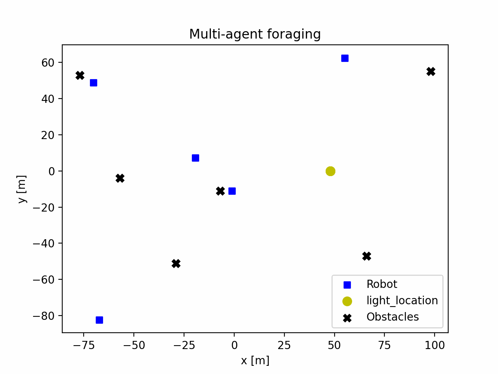
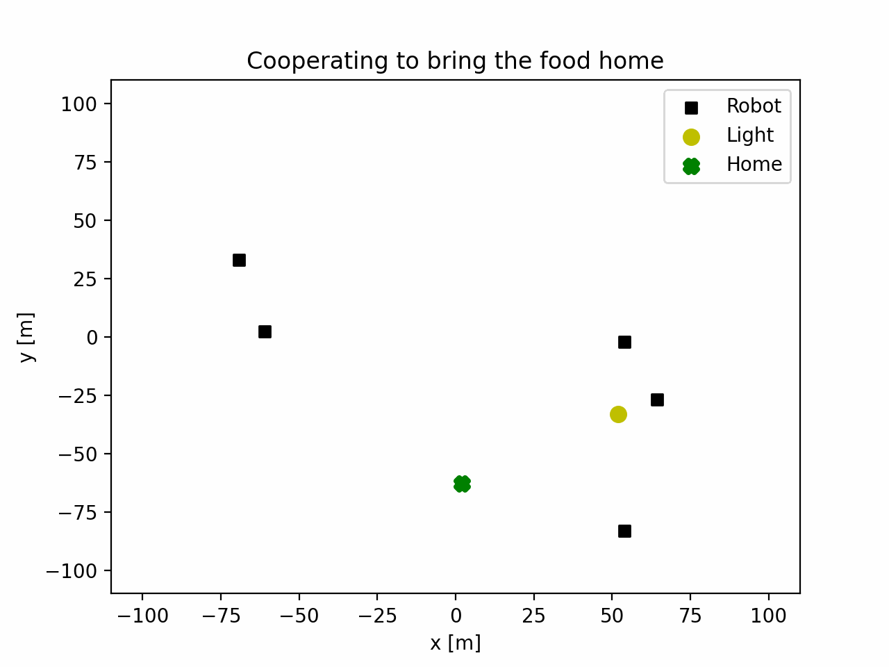

# Solution of Introduction to AI Robotics by Robin R. Murphy Book

## Table of Contents

* [Robotic Paradigms](#)
  * [From Teleoperation To Autonomy](#)
  * [The Hierarchical Paradigm](#)
  * [Biological Foundations of the Reactive Paradigm](#)
  * [The Reactive Paradigm](#)
  * [Designing a Reactive Implementation](#)
  * [Common Sensing Techniques for Reactive Robots](#)
  * [The Hybrid Deliberative/Reactive Paradigm](#)
  * [Multi-agents](#)
* [Navigation](#)
    * [Topological Path Planning](#)
    * [Metric Path Planning](#)
    * [Localization and Map Making](#)
    * [On the Horizon](#)

## Some Questions and Answers

* Multi-agent foraging. Start with only a phototropic and avoid-robot behavior, where a robot is an obstacle that isn’t a light. The program will start with an empty world consisting of a light (you may need to make a "bigger light" by placing lights next to each other). Between 2 and 5 phototropic robots will be placed at different random starting locations in the world. Each will wander through the world, avoiding obstacles, until it comes to a light. Then it will move directly to the light (attractive field). If more than one robot is attracted to the same light, they should center themselves evenly around the light. 

    

* Cooperating to bring the food home. Add the push-to-home behavior where the robot wants to be on a straight line behind the light to home.

    
